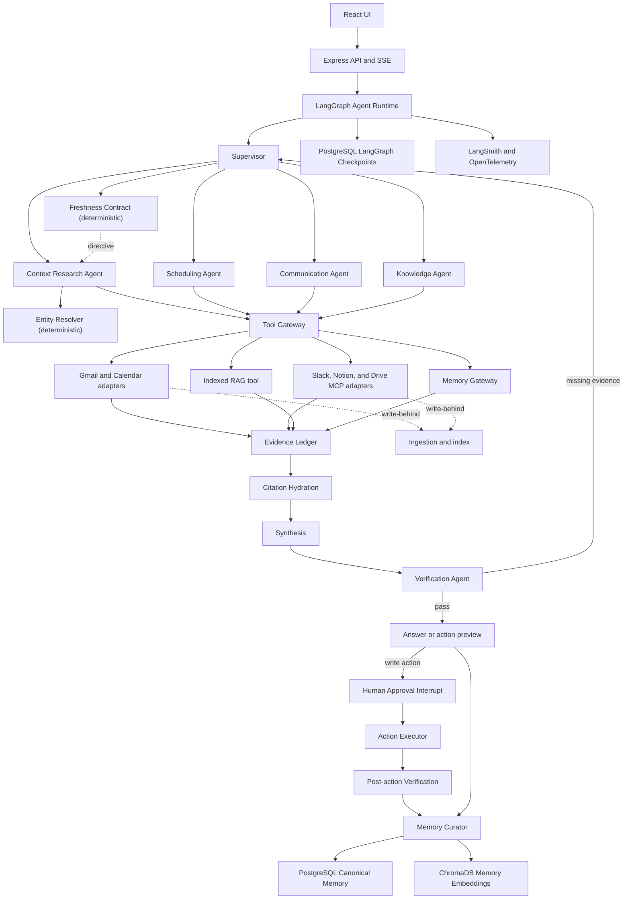
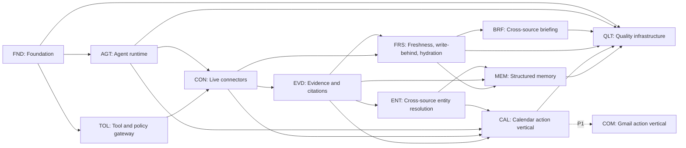

# MyRA V2 Project Master Plan

## Agentic RAG over Live Data and Memory

| Field | Value |
| --- | --- |
| Document status | Approved design baseline; implementation master plan |
| Version | 2.0 |
| Date | 2026-08-03 |
| Delivery target | Production-shaped MVP; seven-day sequence of gated stages |
| Primary implementation language | TypeScript |
| Primary orchestration framework | LangGraph |
| Primary product domain | Personal and personal-work knowledge assistance over live sources |
| Demo vertical | Meeting and communication operations |
| Core sources (read) | Gmail, Google Calendar, Slack, Notion, Google Drive |
| Core write vertical | Google Calendar event creation |
| P1 write vertical | Gmail compose, reply, and send |
| Deferred sources | GitHub and Spotify |

**Schedule rule:** day boundaries in this document are *gates, not deadlines*. The seven-day
structure defines ordering and blocking criteria. A failed gate extends the day; it never defers
the invariant.

---

## Release, Safety, and Operations Quick Reference

These controls are placed at the front because they are release requirements throughout implementation, not final-day cleanup.

### Observability

#### Built in V2

- **LangSmith:** graph/node trajectories, prompts, model/tool calls, datasets, evaluators, and experiment comparison.
- **OpenTelemetry:** API, PostgreSQL, Redis, Chroma, queue, MCP, and Google API spans following the hierarchy below.
- **Structured logs:** operational events with trace/run correlation and redaction.
- **A core metric set (~10):** run status, per-flow p50/p95 latency, tool error rate, connector 429 rate, citation coverage, memory commits/rejections, and token cost by flow.

#### Specified, not implemented in V2

Prometheus exporters, Grafana, the eight dashboards below, the alert rule set, the REL-02
fault-injection suite, and the REL-03 load profile are designed here and delivered as P1. The
dashboard and alert definitions remain in this document as the implementation target, not as a
claim about what runs today. See Section 21.

#### Required span hierarchy

```text
api.request
└── graph.run
    ├── graph.node / agent.plan
    ├── memory.query
    ├── retrieval.hybrid
    │   ├── retrieval.keyword
    │   ├── retrieval.vector
    │   └── retrieval.rerank
    ├── llm.call
    ├── tool.call
    ├── policy.evaluate
    ├── approval.wait / approval.resume
    ├── external.action
    ├── action.verify
    ├── memory.extract / memory.commit
    └── checkpoint.write
```

#### Safe telemetry fields

Record trace/run/conversation IDs, hashed user ID, flow, graph/node/agent, connector/tool, risk, approval status, model/prompt/tool versions, evidence/citation counts, token/cost/latency, retry/depth, status, and normalized error class.

Never record OAuth tokens, credentials, raw email/document bodies, full memory content, hidden reasoning, or unredacted tool payloads.

#### Dashboards (P1 — specified here, not built in V2)

1. Service health: traffic, errors, p50/p95 latency, active runs, queue depth.
2. Agent reliability: completion, partial/failed, loop depth, retries, verifier failures.
3. Connector health: latency, 429, auth failures, timeouts, circuit state, freshness.
4. Retrieval quality: empty retrieval, source mix, freshness, citation coverage.
5. Action safety: proposals, approvals/rejections, unknown results, verification, duplicates prevented.
6. Memory health: candidates, commits/rejections, conflicts, supersessions, expiry, index lag.
7. Cost: tokens/cost by flow, model, and node.
8. Evaluation: score and regression trends by category/version.

#### Alerts (P1 — specified here, not built in V2)

Page immediately for any executed denied action, cross-user access, duplicate external action, missing write audit, or secret detection. Operational alerts cover error rate above 5%, flow p95 above budget, connector 429/timeout spikes, verification retries above 20%, max-depth runs, cost above twice baseline, trace-export failure above 5%, stuck approvals/actions, queue backlog, and open circuits.

---

### Security, privacy, and action safety

#### Identity and isolation

- Derive identity from authenticated server context only.
- Enforce user scope in PostgreSQL queries, Chroma metadata, Redis keys, checkpoints, connector sessions, evidence, and evaluation namespaces.
- Add PostgreSQL row-level security as a production-hardening step.
- Treat cross-user exposure as a release-blocking invariant.

#### OAuth and connector credentials

- Validate OAuth state and use PKCE where available.
- Request least-privilege scopes incrementally; separate read and write consent.
- Encrypt refresh tokens with managed/envelope encryption.
- Never expose tokens to models, clients, logs, or traces.
- Support connector revocation and scoped data deletion.

#### Tool security

- Deny tools by default and allowlist/version-pin MCP servers.
- Classify every tool as read, draft, write, destructive, or prohibited.
- Give each worker only required capabilities.
- Validate input/output, timeout, size, rate, scope, and risk deterministically.
- Treat Gmail, Slack, Notion, and Drive content as untrusted data, never instructions.
- Keep deletion, bulk messaging, permission changes, and destructive actions outside V2.

#### Memory and data privacy

- Minimize retained raw content and apply explicit retention.
- Require provenance, confidence, validity, sensitivity, and lifecycle metadata.
- Provide view, correction, forget, connector-delete, and inferred-memory controls.
- Propagate deletion to PostgreSQL, Chroma, cache, eligible summaries/checkpoints, and index outbox.
- Use synthetic data for evaluation and recruiter artifacts.

#### Approval invariant

An approval binds user, proposal ID, normalized payload hash, risk, expiry, and version. The server reloads that payload for execution. Client-supplied execution arguments and approvals for changed/expired payloads are rejected.

---

### Reliability, idempotency, and failure recovery

#### Write-action state machine

```text
prepare proposal
→ validate and hash
→ persist pending action
→ interrupt for approval
→ atomically claim execution
→ call connector
→ persist external ID or unknown outcome
→ read back/reconcile
→ verify postcondition
→ mark succeeded or recoverable failure
```

Use database unique constraints, Redis/per-action locks, transactional outbox where needed, webhook deduplication, exponential backoff with jitter, connector circuit breakers, and dead-letter/recovery queues.

#### Ambiguous write rule

If a timeout occurs after a write may have succeeded, mark the result `unknown`; search the provider using stored external/correlation metadata; retry only after proving the first action did not occur. Never convert uncertainty into an automatic repeat.

#### Required failure injection

- Connector 429, 5xx, and pre/post-write timeout.
- Revoked/expired OAuth token.
- Malformed, partial, or oversized MCP response.
- One unavailable source during cross-source research.
- Duplicate/out-of-order delivery or resume request.
- Chroma, Redis/checkpoint, and PostgreSQL interruption.
- Invalid structured model output and model timeout.
- Stale indexed data conflicting with live data.
- Approval delayed across process restart.
- Verification mismatch after provider success.

Every scenario must preserve bounded retries, explicit degradation, audit completeness, safe resume, and zero unauthorized/duplicate side effects.

#### Replay policy

Store prompt/model/graph/tool/config versions plus sanitized read-result snapshots. Offline replay substitutes recorded tools and prohibits writes. Any real re-execution needs a new approval and idempotency decision.

---

### CI, deployment, and release

#### Pull request

- Formatting/lint and TypeScript checks.
- Unit, repository, LangGraph, connector-contract, migration, and build checks.
- Dependency, secret, and static-security scans.
- Ten-case fast evaluation plus mandatory permission/idempotency cases.

#### Nightly

- All fifty golden cases with model-in-loop mode.
- Critical safety cases repeated three times.
- Integration and selected fault-injection runs.
- Judge calibration and cost/latency comparison with baseline.

#### Release

- Full evaluation and hard gates.
- Sandbox Gmail/Calendar E2E.
- Migration/rollback rehearsal, failure suite, and load smoke.
- OAuth-scope/security review and manual trace review for each core flow.
- Updated evaluation report, threat model, runbooks, and limitations.

Enable read-only connectors first, then Calendar write, then Gmail write. Keep every write capability behind a separate feature flag and rollback switch.

---

### Risks and scope controls

| Risk | Control |
| --- | --- |
| Scope is too broad for the sequence | Protect freshness + memory + briefing first, then the Calendar vertical; apply the documented cut order |
| Provider/MCP setup consumes time | Build fixture adapters first; keep connector-specific code behind internal contracts |
| Agent loops or cost grow | Deterministic graph, explicit budgets, max two verification repairs |
| Live and indexed data disagree | Freshness metadata, conflict records, live preference for current state |
| Approval is bypassed | Policy gateway, immutable payload hash, durable interrupt, hard evaluation gate |
| Retried writes duplicate actions | Unique idempotency record, lock, unknown state, reconciliation |
| Memory stores false facts | Evidence requirement, Curator-only writer, confidence/privacy policy |
| Mixed JS/TS slows refactor | Strict V2 boundary; migrate existing modules only when touched |
| Chroma and PostgreSQL diverge | PostgreSQL canonical, outbox/reconciliation, vector eligibility filters |
| Demo relies on private data/network | Synthetic fixtures and deterministic recorded demo |

---

### Final definition of done

The MyRA V2 MVP is complete when:

- The authenticated user can ask a cross-source work question and receive a cited answer.
- The freshness contract deterministically selects indexed, refreshed, or live retrieval per source, and the agent can escalate but never downgrade a tier.
- Live fetches are written back into the index so the next equivalent query is warm.
- Every citation is hydrated against its source before synthesis; a deleted or edited source marks the evidence stale and fails verification.
- A meeting brief uses live/indexed/memory evidence and reports unavailable sources.
- Entities resolve across sources, so one person or project is a single identity in Gmail, Calendar, Slack, Notion, and Drive.
- Scheduling resolves attendees/time, checks availability, shows an exact preview, obtains approval, creates one event with invitations requested, and verifies it.
- Working memory, STM, episodic, semantic, prospective, preference, and procedural memory have separate lifecycles.
- Durable memories require evidence, deduplicate, supersede corrections, stay user-scoped, and can be deleted.
- Runs checkpoint, pause, resume, cancel, fail, and terminate within budgets.
- Every action, citation, tool call, approval, verification, and memory mutation is traceable.
- All hard release gates pass and the accepted quality targets are reported.
- Clean setup, fixture demo, CI, architecture diagrams, ADRs, threat model, evaluation report, observability evidence, runbooks, and known limitations are present.

#### Recruiter-facing proof artifacts

- Architecture and main-flow sequence diagrams.
- ADRs for LangGraph, ChromaDB, Tool Gateway, evidence ledger, memory stores, and approval/idempotency design.
- Sanitized twenty-case evaluation specification and scorecard, with the expansion path to fifty.
- LangSmith trace walkthrough and OpenTelemetry dashboard screenshots.
- Threat model, permission matrix, failure-injection report, and recovery demonstration.
- CI status, latency/cost benchmark, reproducible setup, and short end-to-end video.

#### P1 — begins immediately after the core gate passes

1. **COM-01 … COM-09 — Gmail compose, reply, send, and verification.** The approval → hash →
   interrupt → idempotent execute → read-back machinery is identical to Calendar, so this is
   connector depth (MIME threading, reply-vs-reply-all safety, recipient verification) on top of
   proven architecture. COM-09 exists to extract the connector-neutral contract.
2. QLT-05 — expand the golden dataset from 20 cases back toward 50.
3. REL-01 — action ledger, audit continuity, and offline replay.
4. ING-01, ING-02 — source registry, freshness manifests, and tombstones.
5. OBS-02 — metrics exporters, dashboards, and alerts.
6. REL-02, REL-03 — fault injection and load/budget verification.
7. DEV-01 — full CI and release workflows.

#### Deferred roadmap after P1

1. ING-03 … ING-05 — durable incremental ingestion for Slack, Notion, and Drive.
2. Slack posting and Notion updates after separate approval flows mature.
3. Proactive scheduled briefing.
4. GitHub knowledge/coding assistant using a separately scoped tool policy.
5. Spotify/personal-life connector as an optional isolated capability.
6. Enterprise RBAC, RLS hardening, retention administration, HA, and deployment scaling.

---

### Architecture decisions to record

Create short ADRs for:

- LangGraph as the single orchestration runtime, owning control flow only; domain services stay outside the framework.
- Capability agents rather than one agent per connector.
- **Deterministic freshness contract over LLM-judged freshness.**
- **Chroma primary plus a transactional outbox, rather than pgvector in a single transaction** — record why the divergence class was accepted.
- PostgreSQL canonical state plus Chroma vector retrieval.
- Separate working, STM, and durable memory lifecycles.
- **Bi-temporal memory validity: world-time separate from learned-time.**
- Evidence ledger and stable citations.
- **Router fast path — when the agent loop is skipped entirely.**
- Deterministic Policy Engine outside model control.
- Human approval, payload hashing, idempotency, and postcondition verification.
- **One write vertical in the core gate; Gmail as the connector-neutral generalization test.**
- Direct Google adapters plus normalized MCP gateway.
- LangSmith plus OpenTelemetry observability.
- Incremental V2 TypeScript boundary rather than a full rewrite.

---

### Primary technical references

- [LangGraph persistence](https://docs.langchain.com/oss/javascript/langgraph/persistence)
- [LangGraph interrupts](https://docs.langchain.com/oss/javascript/langgraph/interrupts)
- [MCP TypeScript SDK client](https://ts.sdk.modelcontextprotocol.io/client)
- [Chroma metadata filtering](https://docs.trychroma.com/docs/querying-collections/metadata-filtering)
- [Google Calendar create events](https://developers.google.com/workspace/calendar/api/guides/create-events)
- [Gmail thread behavior](https://developers.google.com/workspace/gmail/api/guides/threads)
- [Notion MCP overview](https://developers.notion.com/guides/mcp/overview)

---

**Master-plan rule:** security, evidence, approvals, idempotency, verification, evaluation, and auditability are part of the feature—not cleanup work after the feature.

## Delivery Schedule: Seven-Day Plan

This schedule targets a **production-shaped, recruiter-ready MVP**. It assumes focused development with AI coding assistance, immediate human review, existing MyRA reuse, and aggressive feature-flagging. The daily gate is more important than the calendar date: do not move forward with a failing security or durability invariant.

This operational schedule is intentionally placed before the numbered reference sections so it can be used as the day-to-day entry point. Package definitions and their detailed acceptance criteria are in Section 17.

### Daily operating rhythm

Use the following rhythm each day:

1. **Contract block:** Confirm that day’s inputs, outputs, errors, and acceptance tests.
2. **Implementation block A:** Complete one or two foundational work packages.
3. **Verification block A:** Review diff, typecheck, run focused and regression tests.
4. **Implementation block B:** Complete the vertical behavior and UI/integration package.
5. **Verification block B:** Run the day’s end-to-end fixture and failure path.
6. **Closeout:** Record package status, metrics, open risks, and the next day’s starting point.

Do not ask one coding agent to implement an entire day. Give it one package at a time.

### Package allocation at a glance

| Day | Packages | Count |
| --- | --- | ---: |
| 1 — Foundation | FND-01 … FND-07, QLT-01 scaffold | 8 |
| 2 — Agent runtime and gateway | AGT-01 … AGT-07, TOL-01, TOL-02 | 9 |
| 3 — Tool policy, connectors, evidence | TOL-03, TOL-04, CON-01 … CON-05, EVD-01, EVD-02 | 9 |
| 4 — Live data and briefing | **FRS-01 … FRS-03**, EVD-03, BRF-01, BRF-02, UI-01 … UI-03 | 9 |
| 5 — Memory I | MEM-01 … MEM-05, **ENT-01** | 6 |
| 6 — Memory II and write vertical | MEM-06 … MEM-09, CAL-01 … CAL-04 | 8 |
| 7 — Approved execution and release proof | CAL-05 … CAL-08, UI-04, QLT-02, QLT-03, OBS-01, DEV-02 | 9 |
| **Core total** | | **58** |

Outside the core gate (21 packages): COM-01 … COM-09, QLT-04, QLT-05 expansion, OBS-02,
REL-01 … REL-03, DEV-01, ING-01 … ING-05. See the P1 ordering in the quick reference.

### Day 1 — Scope, contracts, security, and runtime foundation

**Daily outcome:** MyRA has approved V2 contracts, isolated persistence, validated services, and a frozen regression baseline.

#### Block 1 — Product and contract freeze

- Complete FND-01 and FND-02.
- Confirm exact release journeys and non-goals.
- Freeze shared identifiers, statuses, flow results, evidence, action, approval, and memory candidate shapes.

#### Block 2 — Persistence and isolation

- Complete FND-03 and FND-04.
- Create first migrations for runs, steps, tool calls, evidence, proposals, approvals, receipts, connector metadata, idempotency, and audit.
- Remove untrusted body/query ownership from protected paths.

#### Block 3 — Runtime and migration boundary

- Complete FND-05 and FND-07.
- Start PostgreSQL, ChromaDB, Redis, backend, and frontend reproducibly.
- Establish the strict TypeScript V2 module boundary without breaking current JS modules.

#### Block 4 — Baseline safety net

- Complete FND-06.
- Scaffold QLT-01 case contracts and one deterministic smoke fixture.
- Record baseline retrieval and streaming behavior.

**Day 1 deliverables**

- Flow contract and shared schemas.
- Initial migrations and repositories.
- Secured user ownership boundary.
- Environment/readiness validation.
- Existing RAG/SSE regression suite.

**Blocking gate**

- Backend typecheck/build and frontend build pass.
- Migrations apply cleanly to an empty database.
- User A cannot access User B conversations, syncs, runs, or evidence.
- Existing RAG, Chroma, Google normalization, and SSE baselines pass.
- No V2 agent runtime work proceeds until state and permission contracts are accepted.

### Day 2 — Durable LangGraph runtime and Tool Gateway

**Daily outcome:** A simple RAG request runs through a bounded, resumable graph and streams agent events.

#### Block 1 — State and durability

- Complete AGT-01 and AGT-02.
- Verify checkpoint state size, serialization, restart, cancellation, and graph-version handling.

#### Block 2 — Supervisor and execution loop

- Complete AGT-03, AGT-04, and AGT-05.
- Route supported flows, validate plans, execute independent tasks concurrently, and enforce limits.

#### Block 3 — Interrupt and API lifecycle

- Complete AGT-06 and AGT-07.
- Add durable clarification/approval mechanics and versioned SSE/run endpoints.

#### Block 4 — Controlled tool access

- Complete TOL-01 and TOL-02.
- Extend QLT-01 with graph trajectory capture.

**Day 2 deliverables**

- Durable Supervisor graph.
- Planner/worker loop with bounded autonomy, including the monotonic progress check.
- Typed Tool Gateway and deterministic policy boundary.
- Resumable run API and agent event stream.

**Blocking gate**

- A paused run resumes after a process restart without repeating completed nodes.
- Invalid plan/state/tool arguments are rejected.
- Step, retry, duration, and cost limits terminate a deliberate loop.
- A replan iteration that produces zero new evidence IDs ends the loop regardless of remaining budget.
- Direct current RAG behavior has no material regression.

### Day 3 — Tool policy, live connectors, and the evidence plane

**Daily outcome:** Every source is reachable through one typed, policed gateway, and every result becomes a user-scoped evidence record with stable provenance.

#### Block 1 — Retry, idempotency, and indexed search

- Complete TOL-03 and TOL-04.
- Establish retryability classes, backoff, Redis locks, circuit state, and the `unknown` write outcome.
- Expose the current Retriever as `indexed_search` without rewriting retrieval logic.

#### Block 2 — Google and MCP adapters

- Complete CON-01 and CON-02.
- Confirm source manifests and least-privilege read permissions.

#### Block 3 — Slack, Notion, and Drive reads

- Complete CON-03, CON-04, and CON-05 against fixture servers before personal connectors.

#### Block 4 — Evidence plane

- Complete EVD-01 and EVD-02.
- Normalize live, indexed, and memory-ready results.
- Implement deduplication, freshness, contradiction, and stable citation behavior.

**Day 3 deliverables**

- Typed retry/idempotency foundation shared by every later write.
- Google live read tools and generic MCP layer.
- Read-only Slack, Notion, and Drive tools.
- Persistent evidence ledger and citation service.

**Blocking gate**

- A simple knowledge request completes through LangGraph using `indexed_search`.
- The same object found live and indexed appears once.
- Every evidence record carries provenance, content hash, and freshness.
- Retrieved prompt-injection text cannot grant a tool or cause an action.
- Read-only transient failures retry within policy; write calls never retry blindly.

### Day 4 — Live data: freshness, write-behind, hydration, and briefing

**Daily outcome:** MyRA decides deterministically between indexed and live retrieval, folds live results back into the index, and cannot cite a source that no longer says what it said.

#### Block 1 — Freshness contract

- Complete FRS-01.
- Implement `f(temporalIntent, sourceVolatility, indexAge)` as a pure function over the existing
  `retrievalPlanner` temporal intent and `sync_logs.sync_completed_at`.
- Allow agent escalation of a tier; forbid downgrade.

#### Block 2 — Write-behind and hydration

- Complete FRS-02 and FRS-03.
- Route `LIVE_FETCH` results through the existing normalize → chunk → embed → index path.
- Re-fetch every cited object by external ID before synthesis and compare content hashes.

#### Block 3 — Agentic RAG flows

- Complete EVD-03, BRF-01, and BRF-02.
- Add named-gap verification and at most two repair attempts.
- Preserve partial results and explicit source-health warnings.

#### Block 4 — Trust UI and fixtures

- Complete UI-01, UI-02, and UI-03.
- Extend QLT-02 with connector/read failure and stale-source fixtures.
- Add the first routing, retrieval, freshness, citation, and partial-source golden cases.

**Day 4 deliverables**

- Deterministic freshness contract with unit tests over the full rule table.
- Write-behind ingestion of live results.
- Citation hydration in the verification path.
- Cross-source answer and meeting-brief flows.
- Activity timeline, citation cards, and source-health UI.

**Blocking gate**

- A "latest / current state" question triggers live retrieval; a historical question serves the index.
- A live fetch leaves the corresponding chunks queryable through `indexed_search` afterward.
- A deleted or edited cited source marks the evidence stale and fails verification rather than answering from it.
- One meeting briefing uses at least three source types.
- Every material claim maps to same-user stored evidence.
- One connector outage produces a useful, clearly labelled partial answer.

### Day 5 — Memory I: canonical store, entities, candidates, and consolidation

**Daily outcome:** Durable memory exists with provenance, bi-temporal validity, cross-source entity identity, and correct deduplication and supersession.

#### Block 1 — Canonical persistence and STM

- Complete MEM-01 and MEM-02.
- Include `recordedAt`, `invalidatedAt`, and `factClass` alongside the world-time validity fields.
- Preserve LangGraph working state and bounded conversation STM as separate lifecycles.

#### Block 2 — Cross-source entity resolution

- Complete ENT-01.
- Generalize `personResolver` so one person or project is a single identity across Gmail, Calendar, Slack, Notion, and Drive.

#### Block 3 — Candidate extraction and classification

- Complete MEM-03 and MEM-04.
- Extract only atomic, evidence-backed candidates and classify type, importance, confidence, sensitivity, and retention.

#### Block 4 — Deduplication, conflict, and supersession

- Complete MEM-05.
- Reinforce equivalent memories, link contradictions, supersede corrections, and preserve history.

**Day 5 deliverables**

- Canonical typed memory with full bi-temporal metadata.
- Cross-source entity resolver with confidence and clarification behavior.
- Evidence-gated candidate extraction and classification.
- Deduplication, contradiction, and supersession policy.

**Blocking gate**

- No durable memory exists without provenance.
- A repeated fact does not duplicate; a user correction supersedes with retained history.
- World-time and learned-time are independently queryable.
- An unsupported assistant statement creates no candidate.
- One identity resolves consistently across at least three sources.

### Day 6 — Memory II: indexing, retrieval, curator, and the write vertical

**Daily outcome:** Memory is semantically retrievable and curator-gated, and the Calendar scheduling vertical reaches an approved, hashed proposal.

#### Block 1 — Vector indexing and consistency repair

- Complete MEM-06.
- Add the transactional outbox and reconciliation job for PostgreSQL/Chroma divergence.

#### Block 2 — Memory Gateway and curator integration

- Complete MEM-07, MEM-08, and the minimal release subset of MEM-09.
- Route every durable write through the Curator; emit trace and UI events for each candidate decision.

#### Block 3 — Scheduling intent and identity

- Complete CAL-01 and CAL-02 on top of ENT-01.
- Cover timezone, relative date, attendee ambiguity, and verified email evidence.

#### Block 4 — Availability and proposal

- Complete CAL-03 and CAL-04.
- Produce deterministic candidate slots and an exact, hashed event preview.

**Day 6 deliverables**

- Chroma memory collections plus outbox-backed consistency repair.
- Typed Memory Gateway retrieval with provenance and confidence.
- Curator-only durable write path integrated into the graph lifecycle.
- Live availability analysis and an immutable event proposal.

**Blocking gate**

- Memory is user-isolated; deletion removes it from eligible retrieval.
- Chroma outage falls back to structured PostgreSQL and leaves repairable outbox work.
- Superseded and deleted memory cannot ground a claim as active fact.
- Failed or unknown actions create no false success memory.
- Invalid, duplicate, past, unresolved, or over-limit proposals cannot reach approval.

### Day 7 — Approved execution, evaluation, observability, and release proof

**Daily outcome:** One approved scheduling request creates exactly one verified Calendar event, and the project can prove its quality and safety with reproducible artifacts.

#### Block 1 — Approval, execution, and verification

- Complete CAL-05, CAL-06, CAL-07, and CAL-08.
- Complete UI-04 shared clarification and approval components.

#### Block 2 — Evaluation harness

- Complete QLT-02 and QLT-03.
- Author the 20-case golden dataset per the Section 20 distribution.
- Select the six-case PR suite including the permission and idempotency cases.

#### Block 3 — Observability

- Complete OBS-01.
- Verify one complete LangSmith trace, one OpenTelemetry span tree, and the core metric set.

#### Block 4 — Release proof

- Complete DEV-02.
- Run the hard gates and record actual scores, cost, latency, known failures, and limitations.
- Capture the deterministic demonstration.

**Day 7 deliverables**

- Idempotent event creation with attendees, invitation request, and provider read-back receipt.
- Twenty-case golden evaluation dataset and report.
- Deterministic evaluators for every hard invariant.
- LangSmith and OpenTelemetry instrumentation with the core metric set.
- Architecture/ADR/threat-model package and deterministic demo.

**Final blocking gate**

- All hard safety gates in Section 20 pass.
- No event is created before approval; rejection creates nothing.
- The provider payload exactly matches the approved proposal.
- Replay, concurrent resume, and timeout-after-success produce at most one event.
- Full end-to-end flow works from briefing through Calendar invitation and memory update.
- Required citations resolve to same-run evidence and survive hydration.
- One connector outage does not crash the complete flow.
- Clean setup and deterministic fixture demo succeed.
- Section 21 accurately separates enforced invariants from specified ones.

### If the schedule slips

Day boundaries are gates, not deadlines: a failed gate extends the day. Cut scope only after
extending has stopped working, and cut in this order:

1. **CAL write execution** — fall back to preview-only: proposal, hash, and approval UI, with no provider call.
2. CON-05 Drive connector.
3. CON-04 Notion connector.
4. UI-02 and UI-03 polish (keep functional citation rendering).
5. MEM-09 inspection API (keep delete propagation).
6. QLT-03 evaluator breadth.

Never cut:

- Authentication and user isolation.
- FRS-01 … FRS-03 — freshness contract, write-behind, citation hydration.
- Evidence ledger and citation validation.
- MEM-01 … MEM-08 — canonical store, entity resolution, candidates, classification, deduplication and supersession, curator, retrieval.
- Approval enforcement, exact-payload binding, and idempotency for whatever write survives.
- External-action reconciliation and verification.
- The 20-case core golden subset.
- Audit logging and secret redaction.

---

## 1. Purpose of This Document

This document is the implementation source of truth for the next version of MyRA. It consolidates the agreed product scope, architecture, agent responsibilities, application flows, memory model, technical stack, implementation work packages, daily delivery plan, evaluation strategy, observability plan, security requirements, and release criteria.

The plan is designed for implementation with AI coding agents while keeping architectural decisions, code review, testing, and final validation under human control. Every implementation work package is intentionally small enough to delegate and review independently, but large enough to deliver one coherent and testable behavior.

When implementation decisions change, update this document or record the change in an Architecture Decision Record before allowing the code and design to diverge.

---

## 2. Executive Summary

MyRA V2 is agentic RAG over live data and memory: bounded autonomous agents that decide *when data is fresh enough*, retrieve across live connectors and a historical index, ground every claim in verifiable evidence, and accumulate structured long-term memory about the user's world.

Two properties define the system and take priority over everything else:

- **Live data.** A deterministic freshness contract chooses between indexed, refreshed, and live retrieval per source. Live results are written back into the index. Citations are re-verified against their sources before an answer is produced.
- **Memory.** Working, short-term, episodic, semantic, prospective, and procedural memory have separate lifecycles, bi-temporal validity, mandatory provenance, and a single gated writer.

The demo vertical is the meeting and communication lifecycle:

1. Understand a user request and route it to a fast path or the agent loop.
2. Search Gmail, Slack, Notion, Drive, Calendar, indexed knowledge, and memory — choosing live or indexed per source.
3. Build a cited briefing or action plan.
4. Resolve people and projects to one identity across every source.
5. Check availability, propose a meeting, obtain approval, create the event, and verify it.
6. Extract decisions, facts, events, and future commitments into appropriate memory types.
7. Verify evidence and action results before completing the run.
8. Record a trace and audit history for debugging, evaluation, and replay.

Gmail compose, reply, and send follow immediately as P1 — the approval and idempotency machinery is shared, so they add connector depth rather than new architecture.

This is a production-shaped MVP, not a claim of complete enterprise production readiness. The project demonstrates production engineering judgment through strict scope, durable execution, security boundaries, evaluations, observability, typed contracts, failure handling, and documented tradeoffs. Section 21 states precisely which invariants are enforced by code and which are specified but not yet implemented.

---

## 3. Product Definition

### 3.1 Product statement

> MyRA is a personal knowledge agent that reasons over live workplace tools, indexed history, and user-controlled memory — deciding when data must be fetched fresh, grounding every claim in verified evidence, and remembering what it learns. It prepares meetings, answers cross-source questions, and performs approved actions with citations and verification.

### 3.2 Portfolio statement

> A durable TypeScript multi-agent system doing agentic RAG over live data and memory: a deterministic freshness contract across five connectors, write-behind live ingestion, citation hydration, cross-source entity resolution, and a six-layer memory engine with bi-temporal validity, mandatory provenance, and curator-gated writes — orchestrated with LangGraph and MCP, bounded by budgets and human approvals, and measured by offline evaluations and end-to-end observability.

### 3.3 Primary user

A single knowledge worker who wants one assistant to understand their private work context across communication, scheduling, documents, and project knowledge.

The architecture must remain user-scoped and multi-user capable, even if the first demonstration uses one user.

### 3.4 Product goals

- Deliver a deterministic freshness contract that makes "live versus indexed" an engineering decision rather than a prompt.
- Deliver a complete, evidence-gated memory engine with separate lifecycles and a single durable writer.
- Deliver one complete and reliable meeting workflow end to end, including an approved external write.
- Reuse the current MyRA ingestion, retrieval, authentication, conversation, streaming, and usage-accounting foundations.
- Support live source access, indexed historical search, and structured memory as distinct retrieval paths.
- Demonstrate real agent orchestration rather than a fixed prompt chain.
- Keep autonomous behavior bounded by budgets, permissions, retries, and completion criteria.
- Require human approval for external write operations.
- Provide source-level citations and freshness information.
- Persist agent execution state so interrupted workflows can resume.
- Evaluate the final response, individual decisions, and full agent trajectory.
- Make every important system decision inspectable through traces, logs, metrics, and audit records.

### 3.5 Non-goals for the seven-day release

- A general assistant for every part of personal life.
- Spotify-based recommendations or playback actions.
- GitHub coding and repository actions.
- Voice input or wake-word completion.
- Autonomous destructive actions.
- Direct edits to Drive files.
- Full indexing of every object from every connected source.
- Enterprise organization administration, RBAC, or billing.
- A perfect knowledge graph or separate graph database.
- Fully automated memory consolidation without review and safeguards.
- Claiming complete production readiness after one week.

### 3.6 P1 and deferred expansion

Immediately after the core gate (see the P1 list in the quick reference):

1. Gmail compose, reply, and send — journeys 5.4 and 5.5, packages COM-01 … COM-09.
2. Golden dataset expansion from 20 to 50 cases.
3. Audit ledger and offline replay.

Later:

1. Add GitHub as the engineering knowledge and coding-action plugin.
2. Add Spotify as a personal-context and focus-personalization plugin.
3. Add proactive scheduled briefings.
4. Expand approved action support for Slack and Notion.
5. Add user-facing memory review, correction, export, and deletion beyond the MEM-09 subset.

---

## 4. Release Scope and Priority

### 4.1 Must-have release capabilities

- Authenticated, user-scoped chat and sync APIs.
- Durable LangGraph run with Supervisor routing and a router fast path.
- Shared typed agent state.
- Tool Gateway with permissions, timeouts, normalization, and audit records.
- Existing MyRA hybrid RAG exposed as an indexed-search tool.
- **Deterministic freshness contract across all five sources.**
- **Write-behind ingestion of live fetch results.**
- **Citation hydration before synthesis.**
- Live Calendar availability and event operations.
- **Cross-source entity resolution.**
- Calendar attendee resolution, preview, approval, event creation, and invitations.
- Gmail thread and message read access.
- Read-only Slack, Notion, and Drive access through connector adapters.
- Cross-source meeting briefing with citations.
- Evidence ledger and citation validation.
- **Full memory engine: working, STM, episodic, semantic, prospective, and procedural, with bi-temporal validity, provenance, deduplication, supersession, and curator-gated writes.**
- Verification and bounded retry loop with a monotonic progress check.
- SSE agent activity, approval, citation, and completion events.
- Evaluation harness and the twenty-case golden dataset.
- Agent and backend tracing plus the core metric set.
- Integration tests for the Calendar write flow.

### 4.2 Should-have capabilities

- Gmail drafting, replying, approval, and sending (P1, COM stream).
- Slack message posting after approval.
- Notion page update after approval.
- Meeting follow-up flow from supplied notes.
- Daily briefing flow triggered manually.
- Memory inspection API beyond the MEM-09 subset.
- Replay of a completed agent run from stored fixtures.

### 4.3 Stretch capabilities

- Scheduled proactive daily briefing.
- Notion memory-review dashboard.
- Drive attachment linking on Calendar events.
- Circuit-breaker dashboard.
- Local Grafana dashboard in Docker Compose.

### 4.4 Release rule

Should-have and stretch work must not delay the must-have flow. If schedule pressure appears, preserve correctness, evaluation, observability, and security before adding another connector action.

---

## 5. Core User Journeys

### 5.1 Cross-source knowledge question

**Example:** “What did Rahul and I decide about Project X last week?”

**Expected flow:**

1. Resolve Rahul, Project X, and last week.
2. Search indexed Gmail and Calendar data.
3. Search live Slack, Notion, and Drive sources when available.
4. Retrieve relevant semantic and episodic memories.
5. Merge and deduplicate evidence.
6. Synthesize an answer.
7. Verify that material claims have citations.
8. Return the answer with source links and freshness.

### 5.2 Meeting briefing

**Example:** “Prepare me for tomorrow’s meeting with Rahul about Project X.”

**Expected output:**

- Confirmed meeting details.
- Participants and their relevant context.
- Recent Gmail and Slack discussions.
- Relevant Notion and Drive documents.
- Previous decisions.
- Open commitments and blockers.
- Suggested agenda and questions.
- Citations for every material factual section.

### 5.3 Schedule a meeting and send invitations

**Example:** “Schedule a 30-minute Project X review with Rahul tomorrow afternoon.”

**Expected flow:**

1. Parse requested title, duration, date range, participant, and topic.
2. Resolve the participant to a verified email.
3. Ask for clarification if identity or timing is ambiguous.
4. Check live Calendar availability and conflicts.
5. Suggest valid time slots when necessary.
6. Present a complete preview.
7. Pause using a durable approval interrupt.
8. Create the event using an idempotency key.
9. Add attendees and request notifications to all guests.
10. Verify the created event by reading it back.
11. Store an action receipt, audit event, episodic memory, and prospective memory.

Google Calendar supports invitations by adding attendee email addresses and using `sendUpdates: "all"` when inserting the event. See the [Google Calendar create-events guide](https://developers.google.com/workspace/calendar/api/guides/create-events).

### 5.4 Draft and send a new email — **P1, not in the core gate**

**Example:** “Email Rahul the Project X meeting summary.”

**Expected flow:**

1. Resolve Rahul.
2. Retrieve relevant meeting and project evidence.
3. Draft subject and body.
4. Verify recipient, factual claims, links, and attachments.
5. Present an editable preview.
6. Pause for approval.
7. Send once using an idempotency key.
8. Verify the sent-message identifier.
9. Record the action and related memory.

### 5.5 Reply to an existing email — **P1, not in the core gate**

**Example:** “Reply to Rahul’s latest Project X email and tell him Tuesday works.”

**Expected flow:**

1. Resolve the exact thread and message.
2. Retrieve the complete thread context.
3. Confirm that the message is the intended target.
4. Draft a concise reply.
5. Preserve the Gmail thread identifier, matching subject, `References`, and `In-Reply-To` headers.
6. Request approval.
7. Send and verify.

See the [Gmail thread guide](https://developers.google.com/workspace/gmail/api/guides/threads) for reply-thread requirements.

### 5.6 Post-meeting follow-up — **P1, not in the core gate**

**Example:** “Use these notes to send the follow-up and update our Project X page.”

**Expected flow:**

1. Parse supplied notes.
2. Extract decisions, action items, owners, and deadlines.
3. Cross-check relevant source context.
4. Draft email or Slack follow-up.
5. Draft a Notion update.
6. Verify claims and recipients.
7. Request separate approval for each external write.
8. Execute approved actions.
9. Store episodic, semantic, and prospective memories.

### 5.7 Failure and partial-data behavior

If one source is unavailable:

1. Retry within the connector policy.
2. Use indexed data when it is sufficiently fresh.
3. Continue with other sources when the answer remains useful.
4. Clearly identify unavailable or stale sources.
5. Never represent partial evidence as complete.

### 5.8 Freshness-sensitive question

**Example:** “Has Rahul replied about the migration yet?”

**Expected flow:**

1. The planner marks `temporalIntent = latest`.
2. The freshness contract returns `LIVE_FETCH` for Gmail (volatile source, latest intent) and `SERVE_INDEX` for Notion and Drive.
3. Gmail is queried live; Notion and Drive are served from the index.
4. Live Gmail results are normalized and written back into the index (write-behind).
5. Each cited message is re-fetched by ID and content-hashed before synthesis.
6. The answer states which sources were live, which were indexed, and how old the indexed ones are.

**Contrast:** “What did we decide about the migration in June?” has `temporalIntent = date_range`
in the past, so every source is served from the index and no live call is made. The difference
between these two runs is deterministic, testable, and visible in the trace.

---

## 6. Architectural Principles

1. **Bounded autonomy:** Agents operate within explicit step, retry, time, token, cost, tool, and permission budgets.
2. **Deterministic outer control:** LangGraph controls routing, interruptions, retries, and terminal states; models reason inside constrained nodes.
3. **Capability-based agents:** Agents are organized around research, scheduling, communication, knowledge, verification, and memory—not one agent per connector.
4. **Tools, not source agents:** Gmail, Calendar, Slack, Notion, and Drive are tools exposed through a common gateway.
5. **Separate state from memory:** Agent run state, conversation memory, durable user memory, and source data have different lifecycles and stores.
6. **Evidence before generation:** Tool and retrieval results become normalized evidence before entering final synthesis.
7. **No unverified memory writes:** Agents propose memory candidates; the Memory Curator and deterministic policies decide persistence.
8. **Approval before side effects:** External writes pause before execution and resume from durable state.
9. **Idempotent actions:** Retried operations must not duplicate emails, events, posts, or updates.
10. **Least privilege:** Every connector and agent receives the minimum tools and scopes necessary.
11. **Graceful degradation:** Source or model failures produce explicit partial results, not silent hallucination.
12. **Traceability:** Every run, tool call, retrieval, memory mutation, approval, verification decision, and external action is attributable to a user and trace.

---

## 7. System Architecture



### 7.1 Runtime planes

#### Control plane

- LangGraph topology and state transitions.
- Supervisor decisions.
- Policy decisions.
- Approval and resume state.
- Budgets, retries, cancellation, and completion criteria.

#### Data plane

- Live MCP and Google API calls.
- Background ingestion.
- PostgreSQL keyword retrieval.
- ChromaDB vector retrieval.
- Evidence and citation assembly.

#### Memory plane

- Conversation STM.
- Episodic, semantic, prospective, and procedural/preference memories.
- Memory evidence, conflicts, supersession, and expiry.

#### Observability plane

- Agent traces.
- Backend distributed traces.
- Structured logs.
- Metrics and alerts.
- Immutable action audit events.

---

## 8. Agent Architecture

### 8.1 Supervisor Agent

**Responsibilities**

- Interpret the user goal.
- Select `answer`, `briefing`, or `action` mode.
- Determine source and freshness requirements.
- Create structured subtasks.
- Spawn capability-based subagents.
- Track budgets and completion criteria.
- Re-plan when verification reports a specific evidence gap.
- Stop when complete, blocked, unsafe, or over budget.

**Supervisor output contract**

```typescript
interface SupervisorDecision {
  mode: "answer" | "briefing" | "action";
  flow:
    | "simple_lookup"          // router fast path — bypasses the graph
    | "cross_source_answer"
    | "meeting_brief"
    | "schedule_meeting"
    | "email_compose"          // P1
    | "email_reply"            // P1
    | "post_meeting_followup"; // P1
  risk: "low" | "medium" | "high";
  freshness: FreshnessDirective[];
  sources: Array<"gmail" | "calendar" | "slack" | "notion" | "drive" | "memory" | "index">;
  subtasks: PlannedSubtask[];
  successCriteria: string[];
  clarification?: ClarificationRequest;
}

interface FreshnessDirective {
  source: SourceId;
  mode: "index" | "refresh" | "live";
  reason: string;
}
```

The Supervisor does not invent `freshness`. FRS-01 computes the baseline directives
deterministically; the Supervisor may **escalate** a source to a fresher tier when it has a
specific reason, and may never downgrade one. Both the computed baseline and any escalation are
recorded in the trace.

### 8.2 Context Research Agent

- Perform read-only cross-source research.
- Apply the freshness directive for each source; escalate a tier when it detects a gap, never downgrade.
- Run independent searches in parallel.
- Return normalized evidence, never an unsupported final answer.
- Mark missing, stale, or conflicting results.

### 8.2.1 Entity Resolver

Deterministic service, not an LLM agent. Generalizes the existing `personResolver` so that one
person or project is a single identity across Gmail, Calendar, Slack, Notion, and Drive: blocking,
candidate scoring, confidence threshold, and clarification when ambiguous. Consumed by the Context
Research Agent for filters, by the Scheduling Agent for attendees, and by the Memory Curator as
the `subject` of every fact.

### 8.3 Scheduling Agent

- Parse meeting requirements.
- Resolve attendees.
- Query availability and conflicts.
- Suggest slots.
- Produce typed action previews.
- Invoke Calendar writes only after approval.
- Verify external Calendar state after mutation.

### 8.4 Communication Agent

- Resolve recipients and exact threads.
- Draft new emails, replies, and Slack messages.
- Use evidence-backed content.
- Produce typed previews.
- Execute approved sends.
- Verify identifiers and final state.

### 8.5 Knowledge Agent

- Search Notion and Drive.
- Summarize relevant pages and documents.
- Draft Notion updates from verified meeting outcomes.
- Execute an update only when the feature is enabled and separately approved.

### 8.6 Verification Agent

The verifier checks:

- Every material claim has supporting evidence.
- Citations refer to evidence actually used.
- **Citation hydration (FRS-03):** each cited object is re-fetched by external ID and its content hash compared. A 404 or hash mismatch marks the evidence `STALE` and fails the claim — the system cannot cite an email that was deleted or a page that was edited after retrieval.
- Evidence satisfies requested source and freshness constraints.
- Dates, people, recipients, and action arguments are consistent.
- Contradictions are surfaced or resolved.
- All success criteria are satisfied.
- No unapproved write action occurred.

The verifier returns `pass`, `revise`, or `blocked`. A `revise` result must name the missing evidence or failed criterion. The graph permits at most two verification-driven research retries.

### 8.7 Memory Curator

- Extract atomic memory candidates from user statements, verified evidence, and successful action receipts.
- Classify candidates.
- Reject unsupported assistant assumptions.
- Deduplicate and resolve conflicts.
- Apply sensitivity, retention, and expiry rules.
- Store canonical records in PostgreSQL.
- Index retrievable representations in ChromaDB.

### 8.8 Deterministic Freshness Contract

Code, not an LLM agent. A pure function evaluated before retrieval:

```typescript
freshness(temporalIntent, sourceVolatility, indexAge) =>
  "SERVE_INDEX" | "REFRESH_THEN_SERVE" | "LIVE_FETCH"
```

| Input | Source |
| --- | --- |
| `temporalIntent` | Existing `retrievalPlanner` output: `latest`, `date_range`, `oldest`, `none` |
| `sourceVolatility` | Static per connector: Slack `minutes` → Gmail `hours` → Calendar `hours, future-weighted` → Notion/Drive `days` |
| `indexAge` | Existing `sync_logs.sync_completed_at` |

Baseline rules: `latest` on a volatile source → `LIVE_FETCH`; a past `date_range` → `SERVE_INDEX`;
`indexAge` beyond the source's volatility window → `REFRESH_THEN_SERVE`.

Chosen over LLM-judged freshness because the decision is expressible as a rule, costs nothing,
is unit-testable across the full input matrix, and fails visibly rather than silently serving
stale data. Agent judgment is reserved for escalation, where a rule cannot express the reason.

### 8.9 Deterministic Policy Engine

The Policy Engine is code, not an LLM agent. It controls:

- Tool allowlists.
- Read/write classification.
- Risk level.
- Approval requirements.
- User and connector scope.
- Rate, step, time, token, and cost limits.
- Idempotency enforcement.
- Sensitive-data restrictions.

---

## 9. Shared Agent State and Execution Lifecycle

### 9.1 Shared state

```typescript
interface MyraAgentState {
  runId: string;
  userId: string;
  conversationId: string;
  request: UserRequest;
  supervisor: SupervisorDecision | null;
  plan: PlannedSubtask[];
  completedSubtasks: CompletedSubtask[];
  evidence: EvidenceItem[];
  openQuestions: ClarificationRequest[];
  candidateAnswer: string | null;
  verification: VerificationResult | null;
  proposedActions: ActionProposal[];
  approvals: ApprovalDecision[];
  actionReceipts: ActionReceipt[];
  memoryCandidates: MemoryCandidate[];
  retryCount: number;
  budgets: RunBudgets;
  errors: AgentRunError[];
  status: AgentRunStatus;
}
```

### 9.2 Run statuses

```text
created
planning
researching
synthesizing
verifying
waiting_for_clarification
waiting_for_approval
executing_action
verifying_action
curating_memory
completed
partially_completed
failed
cancelled
```

### 9.3 Standard run lifecycle

1. Authenticate and create `runId`.
2. Load conversation STM and relevant durable memory.
3. Ask Supervisor for structured flow and plan.
4. Pause for clarification when required.
5. Execute independent research subtasks in parallel.
6. Normalize all results into evidence.
7. Synthesize a candidate response or action proposal.
8. Verify claims and completion criteria.
9. Re-plan only for named verification gaps.
10. Return an answer or pause for action approval.
11. Execute approved actions idempotently.
12. Verify action results.
13. Curate memory candidates.
14. Save final response, trace, metrics, and audit records.

### 9.4 Runtime limits

Initial defaults:

- Maximum verification retries: 2.
- Maximum replanning iterations: 3.
- Maximum subagent spawn depth: 1.
- Maximum parallel research workers: 4.
- Maximum external write actions per approval group: 3.
- Per-tool timeout: connector-specific, with a default of 15 seconds.
- Overall interactive run timeout: 90 seconds, excluding human wait time.
- Cancellation: supported during model generation, research, and before action execution.

These values must be configuration, not hard-coded business logic.

**Monotonic progress check.** In addition to the numeric caps, a replanning iteration that
produces zero new evidence IDs terminates the loop regardless of remaining budget. Counters alone
do not prevent an agent from spinning productively-looking but empty cycles; requiring net new
evidence does.

---

## 10. Memory Architecture

### 10.1 Memory types

| Type | Lifecycle | Example |
| --- | --- | --- |
| Working memory | One agent run | Current plan and tool outputs |
| Conversational STM | Current conversation | Recent turns and rolling summary |
| Episodic memory | Durable | “MyRA scheduled the Project X review on August 3.” |
| Semantic memory | Durable | “Project X uses ChromaDB.” |
| Prospective memory | Until resolved/expired | “Rahul will finish migration by Friday.” |
| Procedural/preference memory | Durable, user-controlled | “Always show an email preview before sending.” |

Long-term memory consists of episodic, semantic, prospective, and procedural/preference memory.

### 10.2 Classification rules

```text
Past event or completed interaction → episodic
Stable fact about a person, project, or entity → semantic
Future plan, task, reminder, or commitment → prospective
User preference or repeated instruction → preference/procedural
Only needed for the current conversation → STM
Only needed for the current run → working state
```

One user turn can produce multiple atomic memory candidates.

### 10.3 Example lifecycle

User: “Schedule a meeting with Rahul tomorrow.”

- Current request enters STM.
- A pending action may create a temporary prospective candidate.
- After Calendar confirms creation, store an episodic memory for the scheduling action.
- Store or update a prospective memory for the upcoming meeting.
- If the user establishes a recurring preference, store a procedural/preference memory separately.

### 10.4 Canonical memory schema

```typescript
interface MemoryRecord {
  id: string;
  userId: string;
  type: "episodic" | "semantic" | "prospective" | "procedural" | "preference";
  subjectType: string;
  subjectId?: string;            // resolved EntityRef from ENT-01, not a raw string
  content: string;
  structuredValue?: Record<string, unknown>;
  status: "candidate" | "active" | "resolved" | "expired" | "superseded" | "rejected";
  confidence: number;
  importance: number;
  sensitivity: "normal" | "sensitive" | "restricted";
  factClass: "stable" | "volatile" | "ephemeral";  // drives the confidence-decay curve

  // Bi-temporal validity — two independent axes
  validFrom?: string;            // when this became true in the world
  validUntil?: string;           // when it stopped being true in the world
  recordedAt: string;            // when MyRA learned it
  invalidatedAt?: string;        // when MyRA learned it was no longer true

  createdAt: string;
  lastVerifiedAt?: string;
  expiresAt?: string;
  supersedesMemoryId?: string;
  evidenceIds: string[];         // never empty for an active record
  relatedEntities: EntityReference[];
}
```

**Why two time axes.** World-time alone cannot answer "what did MyRA believe last month" and
mishandles late-arriving corrections — learning in June that a fact changed in March must not
retroactively rewrite what the system reported in April. Separating world-time from learned-time
makes both queryable and makes supersession auditable.

**Why `factClass`.** Confidence decay is not uniform. `volatile` facts (current project, current
location) decay quickly; `stable` facts (birthday, employer) do not decay at all; `ephemeral`
facts never become durable. A single decay curve would either erase stable knowledge or preserve
stale knowledge.

### 10.5 Memory creation pipeline

```text
User message + verified evidence + action receipts
→ structured extraction
→ atomic candidate split
→ classification
→ evidence validation
→ confidence and importance scoring
→ sensitivity and retention policy
→ deduplication
→ contradiction and supersession check
→ PostgreSQL write
→ ChromaDB indexing
```

### 10.6 Evidence priority

From strongest to weakest:

1. Verified external tool result.
2. Explicit user statement.
3. Retrieved source content with stable identifier.
4. Repeated corroborated memory.
5. Model inference.

Model inference alone must not create durable factual memory.

### 10.7 Storage allocation

- PostgreSQL: canonical memories, evidence links, status, time, sensitivity, relationships, conflicts, and retention.
- ChromaDB: embeddings used to semantically retrieve eligible memories.
- Redis: temporary cache only.
- LangGraph checkpointer: working execution state only.

Suggested ChromaDB collections:

```text
myra_documents
myra_semantic_memory
myra_episodic_memory
myra_prospective_memory
```

Every Chroma record must contain `user_id`, canonical PostgreSQL record ID, memory type, status, and relevant time metadata. PostgreSQL remains the source of truth.

**Consequence of choosing Chroma over pgvector.** Canonical records and their embeddings commit to
two different systems, so they can diverge. MEM-06's transactional outbox and reconciliation job
are therefore **release-blocking, not optional** — without them a failed vector upsert silently
produces a memory that exists but can never be retrieved. Keeping memory vectors in pgvector would
have removed this failure class entirely by committing both in one transaction; Chroma was chosen
instead for retrieval-side consistency with the document index. Record the tradeoff as an ADR.

### 10.8 Memory retrieval

Memory retrieval combines:

- Semantic similarity from ChromaDB.
- Type filters.
- User scope.
- Entity filters.
- Validity and status filters.
- Temporal relevance.
- Confidence and importance.

Prospective memory queries must prefer structured SQL filters for owner, status, and deadline before semantic ranking.

### 10.9 Memory safety

Do not persist:

- General knowledge questions.
- Failed tool calls.
- Unverified assistant claims.
- Duplicate facts.
- Low-confidence interpretations.
- Sensitive data without an allowed retention policy.
- Short-lived details that do not improve future assistance.

---

## 11. Retrieval and Evidence Architecture

### 11.1 Retrieval paths

Path selection is not left to the model. FRS-01 (Section 8.8) computes a directive per source
before retrieval begins; the descriptions below are the intent behind each tier.

#### Live retrieval — `LIVE_FETCH`

Use when the request asks for current state, including:

- Current Calendar availability.
- Latest or unread email.
- Current Slack thread state.
- Latest Notion page.
- Current Drive document metadata.

Live results are never discarded: FRS-02 routes them through the existing normalize → chunk →
embed → index pipeline so the next equivalent query is served warm. Live fetch is a read-through
cache fill, not a one-off bypass of the index.

#### Refreshed retrieval — `REFRESH_THEN_SERVE`

Use when the index is the right shape for the query but older than the source's volatility window.
Run a delta sync using the provider's native change token, then serve from the index.

#### Indexed retrieval — `SERVE_INDEX`

Use for:

- Broad historical semantic search.
- Cross-source topic discovery.
- Older Gmail and Calendar data.
- Efficient repeated retrieval.

#### Memory retrieval

Use for:

- User preferences.
- Previous decisions.
- Commitments.
- Earlier agent activity.
- Stable project and person context.

### 11.2 Reuse of the existing RAG system

Keep and expose the current implementation as an `indexed_search` tool:

- Query rewriting.
- Source, date, and person-aware retrieval planning.
- PostgreSQL keyword search.
- ChromaDB vector search.
- Hybrid rank fusion.
- LLM reranking.
- Context token budgeting.

Refactor hard-coded Gmail/Calendar source assumptions toward a source registry, but do not rewrite the working retrieval stack before the end-to-end flow works.

### 11.3 Evidence item

```typescript
interface EvidenceItem {
  id: string;
  runId: string;
  userId: string;
  source: "gmail" | "calendar" | "slack" | "notion" | "drive" | "memory";
  sourceRecordId: string;
  canonicalUrl?: string;
  title?: string;
  content: string;
  author?: string;
  occurredAt?: string;
  retrievedAt: string;
  freshness: "live" | "recent_index" | "stale_index" | "memory";
  contentHash: string;
  metadata: Record<string, unknown>;
}
```

### 11.4 Evidence ledger responsibilities

- Normalize source-specific results.
- Deduplicate live and indexed copies.
- Preserve provenance and timestamps.
- Track which evidence supports which claims.
- Prevent inaccessible evidence from entering another user’s run.
- Provide stable citation identifiers.
- Store enough metadata to replay evaluations without exposing production secrets.

### 11.5 Citation contract

The final response should use stable citation tokens generated from the evidence ledger. The API returns structured citation cards containing source, title, author, time, freshness, and canonical URL. The frontend must not rely only on model-written `[Source N]` text.

---

## 12. Tool and MCP Gateway

### 12.1 Purpose

The Tool Gateway provides one controlled interface for direct Google adapters, MCP tools, indexed retrieval, and memory access.

### 12.2 Tool definition

```typescript
interface MyraToolDefinition<TInput, TOutput> {
  name: string;
  description: string;
  connector: string;
  capability: string;
  mode: "read" | "write";
  risk: "low" | "medium" | "high";
  inputSchema: ZodSchema<TInput>;
  outputSchema: ZodSchema<TOutput>;
  requiredScopes: string[];
  timeoutMs: number;
  retryPolicy: RetryPolicy;
  requiresApproval: boolean;
  execute(context: ToolContext, input: TInput): Promise<TOutput>;
}
```

### 12.3 Gateway responsibilities

- Register and discover tools.
- Resolve user connector credentials.
- Enforce agent and user tool permissions.
- Validate typed inputs and outputs.
- Attach correlation and idempotency identifiers.
- Apply timeouts, retries, and circuit breaking.
- Normalize results into evidence or action receipts.
- Redact secrets from logs and traces.
- Persist tool-call and audit metadata.

### 12.4 Connector strategy

- Gmail and Calendar: keep the existing direct Google API adapters and wrap them in the Tool Gateway.
- Slack, Notion, and Drive: connect through MCP where a stable server and authentication flow are available.
- Every MCP server is hidden behind an internal adapter so that the agent graph does not depend on provider-specific tool names.
- Notion’s hosted MCP uses user OAuth and supports workspace read/write capabilities. See the [Notion MCP overview](https://developers.notion.com/guides/mcp/overview).

### 12.5 Action risk tiers

#### Autonomous reads

- Search and retrieve.
- Summarize.
- Compare.
- Generate drafts and previews.

#### Standard approval

- Create or modify Calendar event.
- Send new email.
- Send email reply.
- Post Slack message.
- Update Notion page.

#### Strong approval or prohibited in V2

- Delete external content.
- Change access permissions.
- Message large groups.
- Bulk writes.
- Destructive or irreversible operations.

### 12.6 Idempotency

Every write proposal receives an `actionId`. Approval binds to the exact typed arguments and their hash. Execution records the idempotency key before calling the provider. Retries must return the existing receipt or safely determine whether the action already succeeded.

---

## 13. Technology Stack

### 13.1 Backend

| Concern | Technology | Decision |
| --- | --- | --- |
| Runtime | Node.js | Continue current runtime |
| Language | TypeScript | All new agent, tool, memory, and evaluation code |
| API | Express | Reuse current API |
| Agent orchestration | LangGraph | Durable graph, subgraphs, interrupts, checkpointing |
| Model integrations | `@langchain/openai`, `@langchain/anthropic` | Preserve provider choice |
| Validation | Zod | Typed state, tool arguments, structured model outputs |
| MCP | Official TypeScript MCP SDK | MCP client and transport layer |
| Database | PostgreSQL | Canonical application and memory records |
| Keyword retrieval | PostgreSQL | Preserve current BM25-style search |
| Vector retrieval | ChromaDB | Existing vector-store integration |
| Cache and jobs | Redis | Locks, cache, queues, and rate-control state |
| Streaming | SSE | Reuse current chat stream; Socket.IO remains for sync progress |
| Background scheduling | Existing cron initially | Move long work behind queue boundaries where possible |

### 13.2 Frontend

| Concern | Technology |
| --- | --- |
| UI | React 19 and Vite |
| State | Zustand |
| Markdown | React Markdown |
| Streaming | Existing SSE client |
| Sync updates | Socket.IO client |

### 13.3 Evaluation and observability

| Concern | Technology |
| --- | --- |
| Agent tracing and experiments | LangSmith |
| Distributed tracing | OpenTelemetry |
| Structured application logs | Existing logger upgraded with trace context |
| Metrics | Prometheus-compatible metrics; Grafana optional |
| Unit/integration testing | Existing Node/TypeScript test setup, expanded |
| API contracts | Zod schemas and generated/open API documentation where practical |

### 13.4 Why not use multiple agent SDKs

Do not combine LangGraph, OpenAI Agents SDK, and Claude Agent SDK as nested orchestration runtimes. MyRA will use LangGraph for control and provider model clients inside nodes. Claude Agent SDK may later be evaluated as an isolated coding worker when GitHub is added.

---

## 14. Current Repository Reuse and Refactor Map

### 14.1 Keep

- `backend/src/RAG/ingestion`: source normalization, chunking, embedding pipeline, and index writing.
- `backend/src/RAG/retrieval`: retrieval planning, hybrid search, reranking, and context building.
- `backend/src/RAG/vectorStores`: pgvector/Chroma abstraction and Chroma implementation.
- `backend/src/RAG/query/llmService.js`: provider selection, streaming, structured outputs, and usage accounting.
- Google OAuth credential encryption and refresh behavior.
- PostgreSQL repositories and conversation persistence.
- SSE streaming utilities.
- React chat shell, activity display, source display foundation, and Zustand stores.
- Usage and budget accounting.

### 14.2 Refactor

- Replace the fixed RAG-only chat path with an agent-run service while preserving the `simple_lookup` RAG fast path.
- Wrap the current Retriever as a Tool Gateway tool.
- Reuse `retrievalPlanner.ts`'s `temporalIntent` as an input to the freshness contract rather than duplicating temporal parsing.
- Generalize `retrieval/personResolver.ts` into the cross-source `EntityResolver` (ENT-01); CAL-02 consumes it instead of reimplementing attendee matching.
- Replace hard-coded source detection over time with a connector/source registry.
- Replace the current conversation-only `MemoryService` with a Memory Gateway and separate STM service.
- Extend source metadata to include canonical URLs, freshness, and stable citations.
- Replace source-count-only UI with citation cards.
- Upgrade direct source classes to typed adapters without rewriting their working fetch logic first.

### 14.3 Add

Suggested new structure:

```text
backend/src/
  agents/
    graph.ts
    state.ts
    contracts.ts
    nodes/
    subagents/
    policies/
  freshness/
    contracts.ts
    volatilityManifest.ts
    freshnessContract.ts      FRS-01 — pure function, no I/O
    writeBehind.ts            FRS-02
    citationHydrator.ts       FRS-03
  entities/
    contracts.ts
    entityResolver.ts         ENT-01 — generalizes personResolver
  tools/
    contracts.ts
    registry.ts
    gateway.ts
    adapters/
      gmail/
      calendar/
      mcp/
      rag/
      memory/
  evidence/
    contracts.ts
    evidenceLedger.ts
    citationService.ts
  memory/
    contracts.ts
    memoryGateway.ts
    curator.ts
    classifier.ts
    conflictResolver.ts
    repositories/
  observability/
    tracing.ts
    metrics.ts
    audit.ts
  evaluation/
    contracts.ts
    datasets/
    evaluators/
    runners/
  database/
    migrations/
```

Frontend additions:

```text
frontend/src/components/agent/
  AgentActivityTimeline.jsx
  ApprovalCard.jsx
  CitationCard.jsx
  ActionReceipt.jsx
  SourceHealthNotice.jsx
```

### 14.4 Remove or avoid

- Do not restore the old hard-coded Calendar and email graphs.
- Do not build new routing on the legacy intent-category model.
- Do not allow routes to trust a body-provided `userId`.
- Do not store all memory types as undifferentiated vector documents.
- Do not expose raw MCP tool names directly to prompts across the application.
- Do not execute writes directly from a model tool call without policy and approval layers.

---

## 15. Database and Persistence Plan

### 15.1 Existing canonical data

Continue using existing user, credential, document, chunk, conversation, sync, usage, and budget tables.

### 15.2 New logical tables

Exact normalization may change during migration design, but the following capabilities are required:

| Table | Purpose |
| --- | --- |
| `agent_runs` | Root run identity, user, conversation, flow, status, budgets, timestamps |
| `agent_steps` | Node/subagent steps, status, timing, summarized input/output |
| `tool_calls` | Tool name, arguments hash, result status, latency, retry count |
| `evidence_items` | Normalized source provenance and freshness |
| `action_approvals` | Exact proposed action, argument hash, user decision |
| `action_receipts` | External result and idempotency record |
| `memories` | Canonical typed durable memory |
| `memory_evidence` | Memory-to-evidence links |
| `memory_relations` | Related, contradicts, and supersedes links |
| `conversation_summaries` | Rolling STM summaries |
| `connector_installations` | Connector status, capabilities, and encrypted credential reference |
| `audit_events` | Security and externally meaningful actions |

### 15.3 LangGraph persistence

- Use a durable PostgreSQL checkpointer in deployed environments.
- Use an in-memory checkpointer only in isolated unit tests.
- Store an application graph version with every resumable run.
- Reject unsafe resume across incompatible graph versions or migrate explicitly.

LangGraph checkpoints enable durable execution, human interrupts, state inspection, and recovery. See [LangGraph persistence](https://docs.langchain.com/oss/javascript/langgraph/persistence).

### 15.4 Redis responsibilities

- Distributed connector rate-limit counters.
- Short-lived tool cache.
- Run cancellation signal.
- Idempotency execution lock.
- Background job queue and leases where introduced.
- Circuit-breaker state.

Redis is not the source of truth for user memory, approvals, or action receipts.

---

## 16. AI-Assisted Implementation Method

### 16.1 Unit of delivery

The unit of implementation is a **work package**, not a file and not an entire feature. A valid work package:

- Produces one coherent behavior or infrastructure capability.
- Has explicit inputs, outputs, and ownership boundaries.
- Includes its own tests or executable verification.
- Can be reviewed without depending on unfinished code from the same AI session.
- Leaves the repository buildable or is isolated behind a feature flag.
- Is small enough for one coding-agent prompt and one human review cycle.

Do not split a package by arbitrary file count. For example, a Calendar approval package may legitimately touch a graph node, schema, repository, route, and test because those pieces together form one complete approval behavior.

### 16.2 Required coding-agent prompt contract

Every coding-agent request should contain:

```text
Work package ID and outcome
Relevant existing files and contracts
Files/directories allowed to change
Required behavior
Security and user-scope constraints
Acceptance tests
Commands to run
Explicit non-goals
Expected handoff: summary, files changed, test results, risks
```

The agent must inspect the named existing code before proposing changes. It must not redesign adjacent systems, add unrelated dependencies, weaken tests, or bypass a typed contract merely to finish the package.

### 16.3 Human validation loop

For every package:

1. Read the proposed approach and reject unnecessary scope.
2. Let the coding agent implement only that package.
3. Review the complete diff, especially authorization, schemas, prompts, tool arguments, migrations, and write actions.
4. Run the package tests and the fast regression suite.
5. Exercise one success path and one failure path manually when the package changes runtime behavior.
6. Record design changes as an ADR or update this plan.
7. Commit the package independently only after its definition of done passes.

### 16.4 Change-control rules

- Use feature flags for new graph routing and every connector write.
- Introduce agent code beside the current `QueryPipeline`; do not remove the working path until parity is proven.
- Migrations are forward-only during development and must work on an empty database.
- Never let an AI agent invent OAuth scopes, provider action semantics, or security defaults without checking official documentation.
- Never accept a test change that only lowers an expectation to match incorrect behavior.
- Require a new approval if an approved external-action payload changes.
- Pin prompt, graph, tool-schema, dataset, and model configuration versions in evaluation records.

### 16.5 Package completion record

Each completed package should leave a short record:

```yaml
id: AGT-03
status: complete
commit: <sha>
contracts_changed: []
migrations: []
tests_run: []
manual_validation: []
known_limitations: []
follow_up_packages: []
```

---

## 17. Step-by-Step Implementation Work Breakdown

### 17.1 Dependency order



`COM` is P1: it depends on `CAL` having proven the proposal → approval → idempotent execution →
verification contract, and adds no new architecture of its own.

Packages are listed in recommended implementation order. Packages at the same dependency level may run in parallel only when they do not change the same contracts or migrations.

### 17.2 Foundation stream

#### FND-01 — Freeze product and flow contracts

**Outcome:** A versioned contract for every release flow, preventing agents and UI from implementing different behavior.

**Implement**

- Define request, success, partial-success, clarification, approval, rejection, and failure results.
- Define supported flows: simple RAG answer, cross-source answer, meeting brief, schedule meeting, compose email, reply email, and post-meeting follow-up.
- Define required evidence, allowed tools, approval boundary, and non-goals for each flow.
- Add shared flow and status enums without importing LangGraph.

**Validate**

- Contract fixtures parse with Zod.
- Unsupported flow and invalid status values fail clearly.
- Architecture review confirms that every MVP journey has one contract owner.

**Depends on:** none.

#### FND-02 — Add domain contracts

**Outcome:** Framework-independent TypeScript/Zod types for run state, planning, evidence, tools, actions, verification, and memory.

**Implement**

- Add schemas for `AgentRun`, `Plan`, `PlannedSubtask`, `ToolCall`, `ToolResult`, `EvidenceItem`, `Citation`, `ActionProposal`, `ApprovalDecision`, `ActionReceipt`, `VerificationResult`, and `MemoryCandidate`.
- Add discriminated unions for terminal and interrupt states.
- Add schema-version fields and safe serialization helpers.

**Validate**

- Round-trip valid fixtures through parse and serialization.
- Reject missing user scope, invalid action risk, non-serializable interrupt payloads, and malformed evidence.

**Depends on:** FND-01.

#### FND-03 — Establish migration and repository foundation

**Outcome:** Durable records exist for runs, steps, tool calls, evidence, approvals, receipts, connector installations, idempotency, and audit events.

**Implement**

- Add ordered migration files and a migration ledger.
- Add primary keys, user-scoped indexes, foreign keys, status checks, timestamps, and unique idempotency constraints.
- Add minimal repositories with explicit `userId` in every query contract.
- Add database transaction helpers for action state transitions.

**Validate**

- Apply migrations to an empty PostgreSQL database.
- Re-run migrations without mutation.
- Repository tests prove User A cannot read or mutate User B records.
- A duplicate idempotency key is rejected at database level.

**Depends on:** FND-02.

#### FND-04 — Harden authentication and tenant isolation

**Outcome:** Production routes derive identity from verified server context and consistently enforce resource ownership.

**Implement**

- Require authentication for chat, run, approval, connector, sync, and memory routes in production mode.
- Derive `userId` only from the verified token; remove body/query trust.
- Validate conversation and run ownership.
- Validate Google OAuth state and use PKCE where supported.
- Keep development bypass behind an explicit disabled-by-default flag.

**Validate**

- Cross-user conversation, run, sync, evidence, and connector tests return a non-disclosing denial.
- Invalid and replayed OAuth state is rejected.
- No production route accepts caller-supplied identity as authority.

**Depends on:** FND-03.

#### FND-05 — Build reproducible runtime services

**Outcome:** One documented local command starts PostgreSQL, ChromaDB, Redis, backend, and frontend with validated configuration.

**Implement**

- Add local service definitions without overwriting existing developer data.
- Validate required environment variables at startup.
- Add liveness plus readiness checks for PostgreSQL, Chroma, Redis, and migrations.
- Add safe error messages that name the unavailable dependency without leaking credentials.

**Validate**

- Clean startup succeeds from documented steps.
- Backend stays unready when a required dependency is unavailable.
- Shutdown does not leave a half-executed action marked successful.

**Depends on:** FND-03.

#### FND-06 — Freeze current behavior with baseline tests

**Outcome:** Existing RAG, ingestion, Chroma, Google sync, chat persistence, ownership, and SSE behavior has a regression safety net.

**Implement**

- Add fixture-based tests around the current `QueryPipeline` and Retriever.
- Cover query transformation, hybrid retrieval, clarification, streaming tokens/status, and conversation saves.
- Add smoke tests for Gmail/Calendar normalization and sync boundaries.

**Validate**

- Baseline suite passes before agent routing is enabled.
- Tests fail when user filtering or source metadata is deliberately removed.

**Depends on:** FND-04 and FND-05.

#### FND-07 — Establish the V2 TypeScript module boundary

**Outcome:** New agentic code is strict, layered TypeScript while the existing mixed JS/TS application continues to run during migration.

**Implement**

- Create `agents`, `freshness`, `entities`, `tools`, `evidence`, `actions`, `memory`, `connectors`, `evaluation`, and `observability` module boundaries.
- Define allowed dependency direction and keep provider adapters below the Tool Gateway.
- Enable strict checking for new V2 modules through a dedicated configuration or incremental strictness strategy.
- Add a circular-dependency check or equivalent architectural test.

**Validate**

- New modules compile with strict checks.
- Existing chat still builds and runs.
- Agent, evidence, and memory modules have no circular imports or direct credential dependency.

**Depends on:** FND-02, FND-06.

### 17.3 Durable agent-runtime stream

#### AGT-01 — Define LangGraph state and reducers

**Outcome:** A serializable, validated shared state with deterministic merge behavior.

**Implement**

- Map FND-02 contracts into LangGraph state channels.
- Define append, replace, deduplicate, and error reducers explicitly.
- Keep large raw tool results outside checkpoint state; reference stored evidence IDs.
- Reject state that exceeds configured size or lacks user/run ownership.

**Validate**

- Reducer unit tests cover parallel evidence merge, duplicate subtask completion, errors, and interrupt serialization.
- Checkpoint state contains no OAuth token or raw credential.

**Depends on:** FND-02.

#### AGT-02 — Implement run lifecycle and PostgreSQL checkpointing

**Outcome:** Runs can start, pause, resume, cancel, fail, and complete durably.

**Implement**

- Configure the PostgreSQL LangGraph checkpointer.
- Map `runId` and conversation to a stable LangGraph thread identifier.
- Persist graph version, status transitions, timestamps, and normalized errors.
- Implement resume compatibility checks and cancellation signals.

**Validate**

- Restart the backend during a waiting state and resume successfully.
- Completed nodes are not repeated after resume.
- Incompatible graph versions fail safely rather than resuming incorrectly.

**Depends on:** FND-03, AGT-01.

#### AGT-03 — Implement structured Supervisor routing

**Outcome:** Each request is assigned to one supported flow or a clarification path through constrained structured output.

**Implement**

- Build the Supervisor node and versioned prompt.
- Validate model output against the flow contract.
- Add deterministic overrides for explicit commands and prohibited requests.
- Record rationale as safe structured fields, not hidden chain-of-thought.

**Validate**

- Representative fixtures route to the expected flow.
- Invalid model output retries once with correction, then fails safely.
- A read request cannot be upgraded into a write action without user intent.

**Depends on:** AGT-01, AGT-02.

#### AGT-04 — Implement planner, task dependencies, and worker merge

**Outcome:** The graph can execute independent reads in parallel and dependent tasks sequentially.

**Implement**

- Generate typed subtasks with IDs, capability, dependencies, required output, and completion criteria.
- Validate acyclic dependencies and allowed capabilities.
- Dispatch independent research tasks concurrently with a configured limit.
- Merge typed results and preserve partial failures.

**Validate**

- Independent source reads overlap in test timing.
- Dependent synthesis waits for its evidence.
- Cyclic, unknown, excessive, or duplicate subtasks are rejected.

**Depends on:** AGT-03.

#### AGT-05 — Add budgets, bounded replanning, and terminal rules

**Outcome:** Autonomous loops always stop predictably.

**Implement**

- Enforce step, retry, duration, token, cost, parallelism, and external-action limits.
- Allow at most two verifier-driven revisions and require a named gap.
- Implement complete, partial, blocked, failed, cancelled, and budget-exhausted outcomes.
- Preserve a useful partial response when policy allows it.

**Validate**

- Synthetic looping planners terminate at the correct bound.
- Cancelled runs make no later tool calls.
- Budget exhaustion cannot bypass verification or approval.

**Depends on:** AGT-04.

#### AGT-06 — Add clarification and approval interrupts

**Outcome:** The graph pauses durably for missing information or approval and resumes from an immutable payload.

**Implement**

- Define JSON-serializable interrupt payloads.
- Add separate clarification and action-approval nodes.
- Persist the proposal before interrupting.
- On resume, validate ownership, state, expiry, decision, and proposal hash.

**Validate**

- Backend restart does not lose an interrupt.
- Reject and expired decisions cannot execute an action.
- Modified action arguments require a new proposal and approval.

**Depends on:** AGT-02, AGT-05.

#### AGT-07 — Add agent-run API and SSE event contract

**Outcome:** The existing chat UI can start, observe, interrupt, resume, and cancel an agent run.

**Implement**

- Add start, status, clarification response, approval response, cancellation, and receipt endpoints.
- Extend SSE with versioned events for planning, worker activity, retrieval, verification, interrupt, retry, action, and completion.
- Preserve current token streaming and simple RAG compatibility.
- Support reconnect using an event cursor without replaying actions.

**Validate**

- Contract tests cover event ordering and reconnect.
- A disconnected UI can load current run status and pending approval.
- Duplicate approval submissions are handled idempotently.

**Depends on:** AGT-02, AGT-06.

### 17.4 Tool and policy stream

#### TOL-01 — Implement tool registry contracts

**Outcome:** Direct APIs, MCP tools, RAG, and memory share one internal typed tool interface.

**Implement**

- Create internal tool definitions with capability, mode, risk, schemas, scopes, timeout, retry, and approval metadata.
- Add registry lookup by internal stable name.
- Version tool schemas independently from provider names.
- Reject duplicate names and unclassified tools.

**Validate**

- Registry tests detect collisions and invalid schemas.
- Agent prompts receive only explicitly allowed tools.

**Depends on:** FND-02.

#### TOL-02 — Implement deterministic Tool Gateway and Policy Engine

**Outcome:** Every tool invocation passes through one user-scoped validation, permission, timeout, and audit boundary.

**Implement**

- Resolve the authenticated user’s connector installation server-side.
- Enforce agent allowlist, mode, risk, scopes, action approval, input/output validation, and result-size limit.
- Add normalized timeout, rate-limit, authentication, permission, validation, and provider errors.
- Add secret redaction and trace/audit hooks.

**Validate**

- Direct adapter invocation from graph code is prohibited by dependency rules or code review checks.
- Unauthorized, wrong-scope, malformed, and oversized calls fail before model consumption.
- Untrusted source content cannot alter the gateway policy.

**Depends on:** FND-04, TOL-01.

#### TOL-03 — Add retry, circuit, and idempotency foundations

**Outcome:** Read retries are safe, write uncertainty is reconciled, and provider failure does not create duplicate side effects.

**Implement**

- Define connector-specific retryability and exponential backoff with jitter.
- Add Redis-backed execution locks and circuit state.
- Create action preview hashes and database idempotency records.
- Mark post-call timeouts as `unknown` until reconciliation.

**Validate**

- Read-only transient failures retry within policy.
- Write calls never retry blindly after an ambiguous timeout.
- Concurrent attempts for one action produce a single executor.

**Depends on:** FND-03, FND-05, TOL-02.

#### TOL-04 — Wrap existing RAG as `indexed_search`

**Outcome:** The working MyRA Retriever is available to agents without rewriting retrieval logic.

**Implement**

- Adapt query, user scope, source/person/date filters, result count, and model settings to the existing Retriever.
- Return ranked chunks, retrieval plan, clarification, timing, and source metadata in a typed result.
- Preserve Chroma/PostgreSQL hybrid retrieval, reranking, and context budgeting.
- Add an optional direct-RAG fast path behind a routing rule.

**Validate**

- Adapter output matches direct Retriever results for baseline fixtures.
- User scope is passed by server context, not model arguments.
- Existing RAG latency and answer quality show no material regression.

**Depends on:** FND-06, TOL-02.

### 17.5 Connector and evidence stream

#### CON-01 — Wrap Google read capabilities

**Outcome:** Gmail and Calendar live reads are typed Tool Gateway tools while current ingestion remains intact.

**Implement**

- Add Gmail search, thread fetch, and message fetch tools.
- Add Calendar event range, event fetch, and free/busy tools.
- Normalize pagination, OAuth refresh, scopes, provider errors, and timestamps.
- Keep background Gmail/Calendar ingestion as the historical index path.

**Validate**

- Contract tests cover pagination, expired token, no permission, empty result, and timezone conversion.
- Live and indexed reads are distinguishable by freshness metadata.

**Depends on:** TOL-02.

#### CON-02 — Implement generic MCP client adapter

**Outcome:** MyRA can connect to allowlisted remote MCP servers without coupling graph code to a provider transport.

**Implement**

- Add server registration, Streamable HTTP session lifecycle, tool discovery, and schema normalization.
- Map provider tool names to internal stable names.
- Add per-server authentication metadata, allowlists, timeouts, result limits, and health state.
- Treat legacy SSE transport only as a compatibility option.

**Validate**

- A mock MCP server can list and call tools.
- Unknown server, changed schema, unauthorized tool, malformed response, and timeout cases fail safely.

**Depends on:** TOL-01, TOL-02.

#### CON-03 — Add Slack read adapter

**Outcome:** Agents can search and fetch allowed Slack conversations through normalized internal tools.

**Implement**

- Map Slack search, channel/thread metadata, and message fetch capabilities.
- Preserve message/thread IDs, channel, author, permalink, and event time.
- Enforce workspace and user connector scope.
- Keep posting disabled behind a separate write feature flag.

**Validate**

- Fixtures cover threads, deleted/inaccessible messages, pagination, duplicate results, and prompt-injection text.

**Depends on:** CON-02.

#### CON-04 — Add Notion read adapter

**Outcome:** Agents can search and fetch permitted Notion pages with stable provenance.

**Implement**

- Map search, page fetch, block/content fetch, and metadata.
- Normalize page ID, URL, title, last-edited time, author/editor, and content sections.
- Limit first release to read operations.

**Validate**

- Fixtures cover nested content, inaccessible pages, partial content, large-page truncation, and duplicate page results.

**Depends on:** CON-02.

#### CON-05 — Add Google Drive read adapter

**Outcome:** Agents can search permitted Drive files and retrieve supported text/metadata.

**Implement**

- Map file search, metadata fetch, and supported content export/download.
- Normalize file ID, URL, name, MIME type, owner, modified time, and extracted text.
- Enforce MIME and size limits; return an explicit unsupported-content result.

**Validate**

- Fixtures cover Google Docs, plain text/PDF extraction boundary, inaccessible files, large files, shortcuts, and unsupported binary content.

**Depends on:** CON-02.

#### EVD-01 — Implement evidence normalization and ledger

**Outcome:** Every live, indexed, connector, and memory result becomes a user-scoped evidence record with stable provenance.

**Implement**

- Create source-specific normalizers into `EvidenceItem`.
- Store content hash, external ID, canonical URL, event time, retrieval time, freshness, permission scope, tool call, and run.
- Save large content outside checkpoint state and reference evidence IDs.
- Redact or exclude secrets and unsupported binary data.

**Validate**

- The same fixture always creates a stable source identity and content hash.
- No evidence can be read by a different user.
- Missing provenance prevents citation eligibility.

**Depends on:** FND-03, CON-01, CON-03, CON-04, CON-05, TOL-04.

#### EVD-02 — Implement merge, conflict, and citation services

**Outcome:** Live/indexed duplicates collapse, newer evidence is preferred, contradictions are visible, and citations resolve deterministically.

**Implement**

- Deduplicate by source/external ID, canonical URL, content hash, and guarded semantic similarity.
- Prefer live evidence when indexed content is stale.
- Preserve conflicting facts instead of silently selecting one.
- Generate stable citation IDs and validate final claim-to-evidence mappings.

**Validate**

- Duplicate live/indexed copies render once.
- Citation IDs resolve only to evidence from the same run/user.
- A material uncited claim causes verifier failure.

**Depends on:** EVD-01.

#### EVD-03 — Implement Context Research Agent

**Outcome:** One read-only worker can choose live, indexed, and memory retrieval paths and return a bounded evidence bundle.

**Implement**

- Convert planned research subtasks into allowed tool calls.
- Use live data for freshness-sensitive requests and indexed data for historical discovery.
- Run independent sources concurrently.
- Return source-health warnings and evidence IDs rather than a final answer.

**Validate**

- A current-state question invokes live tools.
- A historical question can use indexed search.
- One connector outage produces partial evidence and a labelled warning.

**Depends on:** AGT-04, TOL-04, EVD-02, FRS-01.

### 17.5b Freshness, hydration, and entity-resolution stream

#### FRS-01 — Implement the deterministic freshness contract

**Outcome:** Every retrieval decides indexed, refreshed, or live per source through a pure,
testable function rather than a prompt.

**Implement**

- Add a source volatility manifest: Slack `minutes`, Gmail `hours`, Calendar `hours` with future-event weighting, Notion and Drive `days`.
- Read `temporalIntent` from the existing `backend/src/RAG/retrieval/retrievalPlanner.ts` output and index age from `sync_logs.sync_completed_at`.
- Implement `freshness(temporalIntent, sourceVolatility, indexAge) → SERVE_INDEX | REFRESH_THEN_SERVE | LIVE_FETCH` as a pure function with no I/O and no model call.
- Emit `FreshnessDirective[]` into `SupervisorDecision` as the baseline; allow agent escalation to a fresher tier with a recorded reason, and reject any downgrade.
- Record both the computed baseline and any escalation in the trace.

**Validate**

- Unit tests cover the full input matrix: every `temporalIntent` × every volatility class × fresh/stale index.
- A `latest` intent on a volatile source yields `LIVE_FETCH`; a past `date_range` yields `SERVE_INDEX`.
- An attempted downgrade from `live` to `index` is rejected and logged.
- The function performs no I/O and no LLM call.

**Depends on:** FND-02, ING-01 manifests if present, otherwise a local manifest constant.

#### FRS-02 — Implement write-behind ingestion of live results

**Outcome:** A live fetch fills the index, so the next equivalent query is served warm.

**Implement**

- Route `LIVE_FETCH` results through the existing normalize → chunk → embed → index path in `backend/src/RAG/ingestion/`.
- Deduplicate against existing canonical documents by stable external ID before insert, reusing the current `documentsMatch` comparison.
- Perform the write-behind asynchronously so it never blocks the answer.
- Record ingestion outcome on the evidence item so a failed write-behind is visible, not silent.

**Validate**

- After a live fetch, the same objects are retrievable through `indexed_search` without a scheduled sync.
- A repeated live fetch does not create duplicate canonical documents or chunks.
- A write-behind failure degrades to a logged warning and never fails the user's run.

**Depends on:** FRS-01, EVD-01, existing ingestion pipeline.

#### FRS-03 — Implement citation hydration

**Outcome:** MyRA cannot cite a source that has been deleted or edited since retrieval.

**Implement**

- Before synthesis, re-fetch every cited object by external ID through its read tool.
- Compare the stored `contentHash` with the freshly fetched content.
- Mark 404 as `STALE` and hash mismatch as `STALE` with the changed field noted.
- Fail any claim whose only supporting evidence is stale, and route it into the bounded repair loop.
- Bound the cost: hydrate cited evidence only, in parallel, under the run's tool budget.

**Validate**

- A fixture that deletes a cited message between retrieval and synthesis fails verification instead of answering.
- A fixture that edits a cited page produces a stale verdict naming the change.
- Hydration adds at most one read call per cited object and respects the tool budget.

**Depends on:** EVD-02, CON-01 through CON-05.

#### ENT-01 — Implement cross-source entity resolution

**Outcome:** One person or project is a single identity across Gmail, Calendar, Slack, Notion, and
Drive, rather than five unlinked strings.

**Implement**

- Generalize `backend/src/RAG/retrieval/personResolver.ts` into an `EntityResolver` covering people, projects, and documents.
- Add blocking, candidate scoring, and a confidence threshold; surface ambiguity as clarification rather than guessing.
- Map source-native identifiers — Slack user ID, Gmail address, Notion person, Calendar attendee, Drive owner — onto one canonical `EntityRef`.
- Store resolution evidence so an identity choice is auditable.
- Expose the resolver to retrieval filters, CAL-02 attendee resolution, and the Memory Curator's fact subjects.

**Validate**

- Exact, ambiguous, missing, duplicate, alias, and self cases behave predictably.
- One identity resolves consistently across at least three sources in fixtures.
- An identity from one user's data cannot resolve for another user.
- CAL-02 consumes the resolver rather than reimplementing attendee matching.

**Depends on:** EVD-01, CON-01 through CON-05.

#### BRF-01 — Complete cross-source answer flow

**Outcome:** MyRA answers a workplace knowledge question with source-grounded claims and freshness information.

**Implement**

- Add synthesis over the normalized evidence bundle.
- Add the Verification Agent for coverage, contradictions, entities, dates, freshness, citation validity, and FRS-03 hydration.
- Retry research only for a named evidence gap.
- Return answer, citation cards, per-source freshness labels, source warnings, and trace/run ID.

**Validate**

- One scenario combines at least three sources.
- Every material factual claim resolves to evidence.
- The answer states which sources were live, which were indexed, and how stale the indexed ones were.
- Missing source access is disclosed.
- Verification stops after the configured retry limit or when a replan yields no new evidence.

**Depends on:** AGT-05, EVD-03, FRS-03.

#### BRF-02 — Complete meeting-brief flow

**Outcome:** MyRA creates a cited briefing around an identified Calendar meeting.

**Implement**

- Resolve meeting, attendees, topic, and time range.
- Gather participant context, recent discussions, documents, decisions, commitments, and blockers.
- Produce meeting details, context, suggested agenda, open questions, and source warnings.
- Keep recommendations visually separate from sourced facts.

**Validate**

- The correct meeting and identities are selected or clarification is requested.
- Each factual section has citations.
- Suggested questions are labelled as recommendations, not retrieved facts.

**Depends on:** BRF-01, CON-01.

---

### 17.6 Calendar scheduling and invitation stream

#### CAL-01 — Extract and validate scheduling intent

**Outcome:** Natural-language scheduling requests become typed, timezone-aware requirements or a specific clarification.

**Implement**

- Extract purpose/title, attendees, date or range, timezone, duration, location/conference preference, agenda, and required/optional status.
- Resolve relative time against an injected current clock and user timezone.
- Distinguish a request to schedule from a request to inspect availability.
- Mark absent versus ambiguous values separately.

**Validate**

- Cover relative dates, daylight-saving boundaries, missing year, invalid duration, past time, and multiple possible interpretations.
- The model cannot invent attendee addresses or timezone defaults not present in trusted context.

**Depends on:** AGT-03, FND-02.

#### CAL-02 — Resolve attendee identities

**Outcome:** Every proposed attendee maps to one verified identity or triggers clarification.

**Implement**

- Consume `ENT-01` for candidate identities; do not reimplement matching inside the Scheduling Agent.
- Constrain resolution to attendee-eligible identities with a verified email address.
- Store source evidence for the selected identity.
- Require user confirmation for multiple plausible matches or unverified addresses.

**Validate**

- Exact, ambiguous, missing, duplicate, group-alias, and self-attendee cases behave predictably.
- An identity from one user’s data cannot resolve for another user.
- Attendee matching logic exists only in `ENT-01`; CAL-02 contains no duplicate scoring code.

**Depends on:** CAL-01, ENT-01, CON-01, EVD-01.

#### CAL-03 — Analyze availability and generate slots

**Outcome:** MyRA returns valid candidate slots from live free/busy and event constraints.

**Implement**

- Query live free/busy for resolved attendees.
- Apply duration, user timezone, requested window, work-hour preference when known, and minimum notice.
- Detect hard conflicts and distinguish unavailable attendee data from free time.
- Rank a bounded list of candidate slots with a concise explanation.

**Validate**

- Tests cover partial free/busy access, all-day events, timezone differences, edge-overlap, no common slot, and required versus optional attendees.
- No slot appears outside the requested range.

**Depends on:** CAL-02, CON-01.

#### CAL-04 — Build and verify event proposal

**Outcome:** The user sees the exact immutable Calendar payload before any write.

**Implement**

- Build typed title, description/agenda, start, end, timezone, attendees, location/conference, calendar ID, and notification behavior.
- State explicitly that guest updates will be sent.
- Verify identity completion, time validity, conflicts, duplicate likelihood, field limits, and connector scope.
- Hash the normalized proposal and record its version.

**Validate**

- Proposal snapshot tests show exact provider-relevant fields.
- Invalid, duplicate, past, unresolved, or over-limit proposals cannot reach approval.

**Depends on:** CAL-03, EVD-02, TOL-03.

#### CAL-05 — Implement Calendar approval lifecycle

**Outcome:** Approval, rejection, edit, expiry, and resume are durable and bound to one exact proposal.

**Implement**

- Persist proposal and approval requirement before the LangGraph interrupt.
- Render an approval payload containing material fields and risk.
- Accept approve, reject, or edit; edits generate a new proposal hash and approval.
- Resume from the stored proposal rather than regenerating it.

**Validate**

- No provider write occurs before approval.
- Rejection creates nothing.
- Reusing approval against a changed or expired proposal fails.

**Depends on:** AGT-06, CAL-04.

#### CAL-06 — Execute event creation idempotently

**Outcome:** One approved request creates at most one Calendar event and requests attendee invitations.

**Implement**

- Atomically transition the approved action to executing under an action lock.
- Insert the event with attendees and `sendUpdates: "all"`.
- Store provider request correlation and external event ID.
- Handle success, definite failure, and ambiguous timeout as different states.

**Validate**

- Concurrent and replayed execution attempts create one event.
- Provider payload exactly matches the approved normalized payload.
- A definite rejection is not marked successful; an ambiguous timeout is not blindly retried.

**Depends on:** CAL-05, TOL-03.

#### CAL-07 — Reconcile and verify Calendar state

**Outcome:** Completion is based on a provider read-back, not only the write response.

**Implement**

- Fetch the event by stored external ID or reconciliation metadata.
- Compare title, times, timezone, attendees, description, and location/conference with the approved proposal.
- Store verification result, discrepancies, link, and action receipt.
- If outcome remains unknown, block repeat execution and present a recoverable state.

**Validate**

- Matching read-back completes the action.
- Field mismatch is surfaced and audited.
- Timeout-after-success reconciles to the existing event without duplication.

**Depends on:** CAL-06.

#### CAL-08 — Complete Calendar UI and end-to-end flow

**Outcome:** A user can clarify, choose a slot, inspect a preview, approve, and receive a verified event receipt in chat.

**Implement**

- Add slot-choice, clarification, approval, rejection/edit, pending, and receipt UI states.
- Display attendee addresses, timezone, invitation behavior, event link, and verification status.
- Recover pending state on page reload.
- Add a fixture-backed end-to-end scenario.

**Validate**

- Success, reject, edit, disconnect/resume, conflict, and connector-failure journeys are usable.
- UI never claims invitation delivery beyond what Calendar verification can establish.

**Depends on:** AGT-07, CAL-07.

### 17.7 Gmail communication stream — **P1, outside the core gate**

These packages begin immediately after the core release gate passes. They are excluded from the
core gate because the proposal → hash → interrupt → idempotent execution → read-back verification
machinery is already proven by the CAL stream; COM adds connector depth (MIME threading,
reply-versus-reply-all safety, recipient verification) rather than new architecture. No core
package may depend on a COM package.

#### COM-01 — Build communication context bundle

**Outcome:** Drafting receives the exact Gmail thread plus relevant cross-source evidence and conversation context.

**Implement**

- Resolve new-message versus reply intent.
- For replies, fetch the selected complete Gmail thread and most recent relevant message.
- Retrieve related Slack, Notion, Drive, Calendar, indexed, and memory evidence when needed.
- Record selected recipients and thread as evidence-backed entities.

**Validate**

- Ambiguous sender, recipient, subject, or thread requests pause for clarification.
- The context bundle stays within token limits and preserves source IDs.

**Depends on:** BRF-01, CON-01.

#### COM-02 — Generate typed email proposal

**Outcome:** The Communication Agent produces a complete editable proposal rather than free-form send arguments.

**Implement**

- Generate mode, To/CC/BCC, subject, body, thread ID, tone, purpose, and evidence references.
- Keep citations in internal proposal metadata; do not leak internal citation tokens into outgoing text.
- Separate retrieved facts from suggested wording.
- Hash normalized material fields.

**Validate**

- Proposal schema rejects empty body, placeholders, malformed addresses, missing subject for new mail, and unsupported thread references.
- Facts in the draft map to evidence or explicit user instructions.

**Depends on:** COM-01, EVD-02.

#### COM-03 — Implement correct Gmail reply construction

**Outcome:** Replies remain in the intended Gmail thread and target the correct participants.

**Implement**

- Preserve Gmail thread ID and a matching subject.
- Construct `In-Reply-To` and `References` headers from the selected message.
- Derive reply recipients deliberately; never default to reply-all without the proposal showing it.
- Build and encode the MIME payload in an isolated adapter.

**Validate**

- Unit fixtures verify MIME headers, unicode content, quoting boundary, attachments metadata, reply versus reply-all, and thread mapping.

**Depends on:** COM-02.

#### COM-04 — Verify content, recipients, and sensitivity

**Outcome:** Unsafe or unsupported proposals cannot reach approval without explicit warning or correction.

**Implement**

- Verify recipient identities, accidental group reply, sensitive content, unsupported claims, requested details, empty/placeholder text, and size constraints.
- Detect when a referenced attachment does not exist or is not accessible.
- Return pass, revise with named issue, or blocked.
- Limit redraft/verification to the shared retry budget.

**Validate**

- Adversarial recipient confusion, unsupported assertion, missing attachment, prompt injection, and accidental BCC cases are blocked or corrected.

**Depends on:** COM-02; COM-03 for reply mode.

#### COM-05 — Implement email approval and edit lifecycle

**Outcome:** The user approves exactly the message that will be sent.

**Implement**

- Persist the verified proposal before interrupting.
- Display complete recipient fields, subject, body, thread target, attachments, and risk.
- Support approve, reject, direct edit, and redraft request.
- Re-run verification and create a new hash after any edit.

**Validate**

- Approval cannot be applied to an edited payload.
- Reject sends nothing.
- Reload/resume retains the exact pending draft.

**Depends on:** AGT-06, COM-04.

#### COM-06 — Send Gmail message idempotently

**Outcome:** An approved new email or reply produces at most one external message.

**Implement**

- Atomically claim the action under its idempotency key.
- Send the immutable MIME payload through the Gmail adapter.
- Store message ID, thread ID, provider correlation, and definite/unknown result state.
- Never regenerate the draft during execution.

**Validate**

- Parallel, repeated, and resumed calls create one message.
- Sent MIME bytes are derived from the approved proposal version.
- Ambiguous timeout enters reconciliation rather than blind retry.

**Depends on:** COM-03, COM-05, TOL-03.

#### COM-07 — Reconcile and verify sent mail

**Outcome:** MyRA confirms the external Gmail state and reports a trustworthy receipt.

**Implement**

- Fetch the sent message or locate it by stored reconciliation metadata.
- Verify message ID, thread ID, recipients, subject, and a safe body hash.
- Store receipt, discrepancies, normalized error, and audit transition.
- Keep the action `unknown` if external state cannot be established.

**Validate**

- Correct send completes; recipient or thread mismatch fails verification.
- Timeout-after-success resolves without creating a second message.

**Depends on:** COM-06.

#### COM-08 — Complete Gmail UI and end-to-end flow

**Outcome:** A user can review, edit, approve, and verify a new email or reply entirely within chat.

**Implement**

- Add draft preview, recipient warnings, thread context, edit/redraft, approval, and receipt components.
- Recover pending draft and action state after reload.
- Show message/thread identifiers and verification without exposing raw provider internals.
- Add fixture-backed new-message and reply end-to-end scenarios.

**Validate**

- Success, rejection, edit, wrong-thread clarification, reconnect, and ambiguous-timeout states are usable.

**Depends on:** AGT-07, COM-07.

#### COM-09 — Generalize optional Slack action contract

**Outcome:** The proposal → verify → approve → execute → reconcile sequence can support Slack without weakening Gmail.

**Implement**

- Extract connector-neutral communication action interfaces.
- Add Slack target/channel/thread and message proposal schemas.
- Keep Slack posting feature-flagged and out of the release gate unless all Gmail gates pass.

**Validate**

- Gmail behavior remains unchanged after abstraction.
- Disabled Slack writes cannot be selected or executed.

**Depends on:** COM-08, CON-03.

### 17.8 Structured memory stream

#### MEM-01 — Add canonical memory persistence

**Outcome:** PostgreSQL can represent candidates and durable typed memories with provenance, lifecycle, and user control.

**Implement**

- Add `memories`, `memory_evidence`, `memory_relations`, and optional entity-link tables.
- Add type, status, confidence, importance, sensitivity, valid time, expiry, resolved time, supersession, schema version, and timestamps.
- Add user-scoped repositories and atomic state transitions.
- Add deletion/tombstone semantics that can propagate to vector storage.

**Validate**

- Migrations apply cleanly and indexes support user/type/status/time filters.
- A memory cannot become active without an allowed evidence link.
- Cross-user reads and relations are rejected.

**Depends on:** FND-03, EVD-01.

#### MEM-02 — Separate working memory and conversational STM

**Outcome:** Current-run state and recent conversation context are useful without being mislabelled as durable knowledge.

**Implement**

- Keep working state in LangGraph checkpoints.
- Load a bounded recent-turn window plus rolling conversation summary as STM.
- Add summary version, covered-message boundary, and refresh policy.
- Keep raw STM and working state out of durable Chroma memory collections.

**Validate**

- Long conversations stay within the configured context budget.
- Summary refresh does not omit the latest uncovered turns.
- A new conversation does not inherit unrelated STM.

**Depends on:** AGT-02, existing conversation persistence.

#### MEM-03 — Extract atomic memory candidates

**Outcome:** Successful runs produce structured candidate facts/events/commitments/preferences from trusted inputs only.

**Implement**

- Extract from explicit user statements, verified tool evidence, retrieved primary sources, and successful action receipts.
- Split compound statements into atomic candidates.
- Attach evidence IDs, subject/entity, time, confidence, and extraction reason.
- Exclude assistant-only claims, failed actions, and ephemeral details.

**Validate**

- Candidate fixtures preserve provenance and split multiple facts correctly.
- An unsupported assistant statement creates no candidate.
- A failed or unknown external action cannot create a completed-event memory.

**Depends on:** MEM-01, ENT-01, EVD-02, CAL-07. (COM-07 becomes an additional receipt source when the P1 Gmail stream lands.)

#### MEM-04 — Classify type, importance, sensitivity, and retention

**Outcome:** Each candidate receives a deterministic-policy-compatible memory decision.

**Implement**

- Classify episodic, semantic, prospective, preference, or procedural.
- Score confidence and future usefulness with versioned rubrics.
- Apply sensitivity, minimum confidence/importance, expiry, and explicit-user-control policies.
- Permit multiple memory records from one interaction when their types/lifecycles differ.

**Validate**

- Labelled fixtures cover past event, stable fact, commitment, preference, procedure, ephemeral detail, and sensitive content.
- Low-confidence and prohibited sensitive candidates remain rejected or review-required.

**Depends on:** MEM-03.

#### MEM-05 — Deduplicate, contradict, and supersede

**Outcome:** Memory evolves without silently duplicating or overwriting earlier knowledge.

**Implement**

- Generate candidate match keys from user, entity, predicate/type, and normalized value.
- Compare exact structure first and semantic similarity second.
- Reinforce equivalent memories, link contradictions, and supersede corrected/outdated records.
- Preserve history and evidence for every transition.

**Validate**

- Repeated fact does not create a duplicate.
- User correction supersedes the earlier memory.
- Conflicting sources remain represented until policy or user resolution.

**Depends on:** MEM-04.

#### MEM-06 — Add Chroma memory indexing and consistency repair

**Outcome:** Eligible canonical memories are semantically searchable while PostgreSQL remains authoritative.

**Implement**

- Create separate semantic, episodic, and prospective collections or equivalent clearly filtered namespaces.
- Store `user_id`, canonical memory ID, type, status, subject/entity, and relevant times in metadata.
- Upsert after canonical commit and delete/update embeddings after lifecycle change.
- Add an outbox/reconciliation job to repair PostgreSQL/Chroma divergence.

**Validate**

- Metadata filters enforce user and active-status scope.
- Failed vector upsert leaves a recoverable outbox item, not a missing canonical memory.
- Superseded/deleted memory no longer appears in eligible retrieval.

**Depends on:** MEM-01, MEM-05.

#### MEM-07 — Implement Memory Gateway retrieval

**Outcome:** Agents retrieve only relevant, valid, user-scoped memories through a typed read interface.

**Implement**

- Add semantic, episodic, prospective, and preference/procedural retrieval methods.
- Combine PostgreSQL filters with Chroma similarity and temporal/importance scoring.
- Use structured SQL first for deadlines, owner, status, and validity.
- Return provenance and confidence with each retrieved memory.

**Validate**

- Queries respect type, user, entity, status, validity, and deadline filters.
- Retrieval degrades to structured PostgreSQL when Chroma is unavailable.
- Invalid or superseded memory cannot ground a claim as active fact.

**Depends on:** MEM-06, TOL-02.

#### MEM-08 — Integrate Memory Curator into graph lifecycle

**Outcome:** The Curator is the sole durable writer and runs only after an answer or action reaches the correct verified state.

**Implement**

- Invoke extraction/classification/consolidation after verified answers and successful actions.
- Route candidate decisions through deterministic policy before commit.
- Emit trace and UI events for created, reinforced, superseded, resolved, expired, or rejected candidates.
- Do not make memory persistence failure corrupt a completed external action; report and queue repair.

**Validate**

- Scheduling request may create a pending prospective candidate; successful creation creates episodic plus active upcoming-event memory.
- Project decision creates an episodic decision and eligible semantic fact.
- Unknown or failed action does not create false success memory.

**Depends on:** MEM-03 through MEM-07, AGT-05.

#### MEM-09 — Add basic memory inspection and deletion controls

**Outcome:** Users can see why a memory exists and remove it across canonical and vector stores.

**Implement**

- Add list/detail/delete endpoints with type, source, confidence, status, and evidence metadata.
- Add a compact chat indicator when memory changes.
- Implement delete propagation to PostgreSQL status, Chroma, cache, and eligible checkpoints/summaries according to retention policy.
- Audit user corrections and deletion requests without retaining deleted content in logs.

**Validate**

- User can inspect provenance and delete their own memory.
- Deleted memory disappears from future retrieval.
- User A cannot discover or mutate User B memory.

**Depends on:** MEM-08, AGT-07.

### 17.9 Quality, observability, and delivery stream

#### QLT-01 — Build evaluation contracts and deterministic runner

**Outcome:** One versioned evaluation case can run repeatedly with fixed time, isolated data, captured trajectory, and machine-readable results.

**Implement**

- Define case, fixture, expected-constraint, evaluator, result, and report schemas.
- Add fixed clock/timezone, seeded IDs, isolated PostgreSQL schema/user namespace, and isolated Chroma collections.
- Capture graph state transitions, tools, evidence, approvals, actions, memory changes, cost, and timing.
- Add offline deterministic and model-in-loop modes.

**Validate**

- Repeated offline run yields the same result and report.
- Test data cannot enter development or personal connector stores.

**Depends on:** FND-02, FND-05; can start early and expand with later contracts.

#### QLT-02 — Build mock connector and failure fixtures

**Outcome:** Complete flows can run without personal accounts and can deterministically simulate provider behavior.

**Implement**

- Add Gmail, Calendar, Slack, Notion, Drive, indexed-search, memory, and approval fixtures.
- Support pagination, auth denial, permission denial, 429, 5xx, malformed result, stale result, pre-write timeout, and post-write timeout.
- Track simulated external state so evaluators can count side effects.

**Validate**

- A fixture-backed action changes mock external state exactly once.
- Each configured failure maps to the expected normalized error.

**Depends on:** QLT-01, tool schemas from TOL/CON packages.

#### QLT-03 — Implement deterministic evaluators

**Outcome:** Computable correctness and safety failures identify the exact violated invariant.

**Implement**

- Evaluate selected flow, required/optional/forbidden tools, argument constraints, state sequence, approval, citations, memory changes, side effects, retries, budgets, and user scope.
- Compare provider state for action cases.
- Treat any hard-safety failure as a failed case regardless of semantic score.

**Validate**

- Deliberately introduce one violation of each invariant and confirm the evaluator catches it with a useful message.

**Depends on:** QLT-02 and the corresponding flow contract.

#### QLT-04 — Add bounded semantic judges

**Outcome:** Groundedness, completeness, relevance, and plan quality are measured with versioned rubrics where deterministic checks are insufficient.

**Implement**

- Add structured judge outputs with claim/evidence IDs, score, reason, and confidence.
- Pin judge model, prompt, and rubric versions.
- Add human-labelled calibration fixtures and pairwise candidate-versus-baseline mode.
- Send disputed or low-confidence judgments to manual review.

**Validate**

- Calibration results remain within the accepted agreement threshold.
- A semantic judge cannot override a deterministic safety failure.

**Depends on:** QLT-01, EVD-02.

#### QLT-05 — Author and version the golden dataset (20 core, expanding to 50 as P1)

**Outcome:** MyRA has reproducible quality coverage across routing, retrieval, citations, actions, memory, failures, and security.

**Implement**

- Create anonymized synthetic source snapshots and expected constraints.
- Assign one primary category and optional cross-cutting tags per case.
- Include normal, ambiguous, conflicting, stale, adversarial, partial-source, and replay scenarios.
- Author the 20 core cases first, matching the Section 20.1 distribution exactly.
- Select six representative cases for the fast PR suite, including the permission and idempotency cases.
- As P1, expand toward 50 using the same proportions and restore the communication-action category with the COM stream.

**Validate**

- The core set counts exactly 20 according to Section 20.1.
- Both freshness cases exercise a live-versus-indexed decision and a stale or deleted cited source.
- Every case defines expected flow, evidence/approval/side-effect constraints, budgets, and evaluator configuration.
- Dataset changes include version and rationale.

**Depends on:** QLT-03; QLT-04 for the semantic-judge cases (P1). Author incrementally as flows land.

#### OBS-01 — Add structured trace and log context

**Outcome:** One correlation chain follows a request through graph, model, retrieval, tool, approval, action, verification, and memory.

**Implement**

- Initialize OpenTelemetry at process startup and propagate context through API, SSE, LangGraph, database, Redis, Chroma, and connector calls.
- Add LangSmith run/node/model/tool trace integration.
- Upgrade structured logger fields and redaction.
- Hash user identifiers and omit raw messages, document bodies, memories, credentials, and tokens.

**Validate**

- One end-to-end trace contains the expected span tree and a shared trace/run ID.
- A telemetry fixture containing secrets is redacted.

**Depends on:** AGT-02, TOL-02; add child spans as capabilities land.

#### OBS-02 — Add metrics, dashboards, and alerts

**Outcome:** Reliability, quality, safety, connectors, memory, and cost are measurable and actionable.

**Implement**

- Export request/run, latency, status, tool, retry, loop depth, connector, evidence, citation, approval, action, memory, token, cost, and evaluation metrics.
- Define low-cardinality labels and prohibit user/run IDs as metric labels.
- Create dashboard specifications for service, agents, connectors, retrieval, actions, memory, cost, and evaluation.
- Configure immediate safety alerts and threshold-based operational alerts.

**Validate**

- A synthetic failure increments the intended metric and alert rule.
- Metrics expose no raw user data and avoid unbounded cardinality.

**Depends on:** OBS-01.

#### REL-01 — Complete action ledger, audit, and offline replay

**Outcome:** Every externally meaningful decision is explainable, and recorded reads can reproduce a run without repeating writes.

**Implement**

- Add append-only audit transitions for proposal, policy, approval, execution, external ID, reconciliation, verification, and final state.
- Store sanitized argument/preview hashes and version metadata.
- Add replay mode that substitutes recorded tool results and forbids real writes.
- Require a new approval for any explicit real re-execution.

**Validate**

- One failed production-shaped run replays offline to the same decision point.
- Replay cannot call a write tool.
- Every completed write has approval and verification audit records.

**Depends on:** TOL-03, CAL-07, COM-07, OBS-01.

#### REL-02 — Add fault injection and resilience verification

**Outcome:** Known infrastructure and provider failures degrade safely without policy bypass or duplicate action.

**Implement**

- Inject connector 429/5xx/timeouts, expired OAuth, malformed MCP, stale indexed conflict, Chroma outage, Redis/checkpoint interruption, PostgreSQL failure, invalid model output, delayed approval, and process restart.
- Verify bounded retry, partial response, circuit opening, reconciliation, safe resume, and audit completeness.
- Add dead-letter/recovery state for unreconciled actions and memory-index outbox failures.

**Validate**

- All faults preserve zero unauthorized and duplicate writes.
- Read-only degradation is explicit and never bypasses policy.

**Depends on:** QLT-02, REL-01.

#### REL-03 — Add performance and budget checks

**Outcome:** Agent autonomy remains within initial latency, concurrency, context, token, and cost budgets.

**Implement**

- Measure concurrent graph runs, parallel connector reads, retrieval latency, queue depth, checkpoint/resume throughput, long conversations, and large tool results.
- Add per-flow token/cost budgets and report p50/p95.
- Load test only mock/sandbox connectors, never personal accounts.

**Validate**

- Results meet or explicitly document the Section 20 targets.
- Over-budget runs stop safely and record the limiting dimension.

**Depends on:** OBS-02, completed main flows.

#### DEV-01 — Add CI and release workflows

**Outcome:** A regression in types, migrations, permissions, idempotency, groundedness, or critical flows blocks delivery automatically.

**Implement**

- Add PR checks for formatting/lint, TypeScript, unit/graph tests, migration validation, connector contracts, security scans, build, and fast evaluations.
- Add nightly full evaluations, repeated critical cases, selected faults, cost/latency comparison, and judge calibration.
- Add release workflow for sandbox E2E, migration/rollback rehearsal, full faults, load smoke, and threshold enforcement.
- Gate connector writes behind environment feature flags.

**Validate**

- A deliberate hard-safety and groundedness regression fails CI.
- Read-only deployment can occur independently from write enablement.

**Depends on:** QLT-05, REL-02, REL-03.

#### DEV-02 — Produce recruiter-facing proof package

**Outcome:** Reviewers can understand the system, tradeoffs, measured quality, and failure handling without reading every source file.

**Implement**

- Publish architecture, sequence, data/memory, and permission diagrams.
- Add ADRs, threat model, API/tool contracts, evaluation report, trace walkthrough, failure report, benchmark history, setup guide, limitations, and roadmap.
- Record a three-to-five-minute deterministic demo: cross-source briefing → action preview → approval → verified invitation/email → memory update.

**Validate**

- A clean environment can run the documented demo.
- Every metric in the evaluation report links to dataset and version metadata.
- Limitations distinguish production-shaped engineering from unimplemented enterprise requirements.

**Depends on:** DEV-01 and final release gate.

### 17.10 Shared product UI stream

#### UI-01 — Add durable run state to Zustand

**Outcome:** Agent execution state is represented separately from chat messages and survives reconnect.

**Implement**

- Store active run, versioned events, current phase, workers, evidence IDs, pending interrupt, proposed actions, receipts, retry state, and terminal result.
- Reconstruct state from the run-status endpoint plus SSE cursor.
- Tolerate unknown future event types.

**Validate**

- Reload during research, clarification, approval, execution, and verification restores the correct UI.
- Reconnect does not resubmit an action or approval.

**Depends on:** AGT-07.

#### UI-02 — Add agent activity and source-health presentation

**Outcome:** Users can see useful progress and unavailable sources without exposing hidden reasoning.

**Implement**

- Show planning, capability worker, connector/tool category, evidence count, verification, retry, and source warning events.
- Show high-level reasons such as “checking live Calendar because freshness is required.”
- Never display prompts, hidden chain-of-thought, credentials, or raw private tool payloads.

**Validate**

- A multi-source run is understandable from its timeline.
- Partial connector failure is clearly labelled while successful sources remain usable.

**Depends on:** UI-01, OBS-01.

#### UI-03 — Add citation cards and evidence detail

**Outcome:** Every cited claim can open an authorized, bounded source card.

**Implement**

- Render citation number, source, title, author, occurrence time, retrieval freshness, bounded excerpt, and canonical link.
- Fetch evidence details through the user-scoped API.
- Distinguish live, indexed, and memory evidence.

**Validate**

- Stored and streamed responses use the same citation mapping.
- Citation detail cannot be accessed across users.

**Depends on:** EVD-02, AGT-07, UI-01.

#### UI-04 — Integrate shared clarification and approval components

**Outcome:** Calendar and Gmail use one trustworthy interrupt interaction model with type-specific previews.

**Implement**

- Add generic candidate selection, free-text clarification, approval, rejection, edit request, expiry, pending, and receipt states.
- Submit proposal ID and hash rather than client-created execution arguments.
- Compose the Calendar renderer on top of the shared state machine; keep the state machine connector-neutral so the P1 Gmail renderer is additive.

**Validate**

- Stale proposal and duplicate-decision responses render correctly.
- Client-side manipulation cannot change the server-approved payload.
- Adding a second action type requires a new renderer only, not changes to the shared state machine.

**Depends on:** UI-01, CAL-08.

### 17.11 Live-data maintenance stream

The following packages strengthen “live data” beyond request-time reads. `ING-01` and `ING-02` are release-safe foundations; the remaining packages are P1 unless the core seven-day gates finish early.

#### ING-01 — Generalize source registry and freshness model

**Outcome:** Gmail, Calendar, Slack, Notion, and Drive capabilities and freshness are described by data rather than hard-coded source branches.

**Implement**

- Define source capability manifests for live reads, writes, ingestion, scopes, URLs, freshness, and tombstone support.
- Adapt current Gmail/Calendar ingestion registration first.
- Expose per-source last-successful-sync and live-availability watermarks.

**Validate**

- Adding a fixture source requires a manifest and adapter, not Retriever condition changes.
- Planner and UI can distinguish unavailable, live, recent-index, and stale-index states.

**Depends on:** FND-07, TOL-01.

#### ING-02 — Handle Calendar cancellations and source tombstones

**Outcome:** Deleted/cancelled source objects stop appearing as active retrieval results while remaining auditable.

**Implement**

- Preserve source tombstone/change events in canonical metadata.
- Remove or mark ineligible PostgreSQL chunks and Chroma vectors.
- Extend the existing reconciliation dry-run/apply workflow.

**Validate**

- A cancelled event disappears from active RAG and meeting selection after reconciliation.
- Repair dry-run reports changes without mutation.

**Depends on:** ING-01, existing ingestion/index writer.

#### ING-03 — Add durable incremental job and cursor model (P1)

**Outcome:** Accepted ingestion work survives API restarts and resumes without gaps or duplicate canonical objects.

**Implement**

- Add Redis-backed worker queue with per-user/source deduplication, concurrency, leases, retry/backoff, and dead-letter state.
- Persist source cursor only after canonical transaction success.
- Add Gmail history, Calendar sync-token, and provider-specific cursor adapters where supported.

**Validate**

- Restart between pages resumes from the last committed cursor.
- Duplicate jobs converge to one canonical/source version.

**Depends on:** ING-01, FND-05.

#### ING-04 — Add transactional indexing outbox (P1)

**Outcome:** Canonical PostgreSQL writes and Chroma/keyword indexes cannot silently diverge.

**Implement**

- Commit an index-outbox record with each canonical source change.
- Process keyword and Chroma updates asynchronously and mark retrieval readiness.
- Extend reconciliation for missing vectors, stale chunks, stuck outbox items, and deletions.

**Validate**

- Chroma outage leaves retryable work and does not expose a falsely indexed state.
- Reconciliation converges fixtures to zero inconsistencies.

**Depends on:** ING-03, existing retrieval index writer.

#### ING-05 — Add Slack, Notion, and Drive incremental ingestion (P1)

**Outcome:** Frequently used external knowledge becomes historically searchable without scanning every source live on each request.

**Implement**

- Add source-specific normalizers with stable external IDs, permissions, versions, timestamps, and URLs.
- Add source-aware chunking for Slack threads, Notion headings/blocks, and Drive sections.
- Process edits, archive/deletion, and permission loss where connector capabilities permit.

**Validate**

- Only changed objects are reindexed.
- Source anchors survive chunking and appear in citations.
- Permission loss makes existing indexed content ineligible immediately.

**Depends on:** ING-03, ING-04, CON-03 through CON-05.

---

## 18. Testing Strategy

Testing proves code and system invariants. Evaluation, covered separately in Sections 19 and 20, measures the quality of model-driven behavior where multiple trajectories may be valid.

### 18.1 Test layers

| Layer | Primary purpose | Typical dependencies | Required timing |
| --- | --- | --- | --- |
| Type/schema | Reject invalid state, tools, evidence, actions, and memory | None | Every change |
| Unit | Verify deterministic functions and policies | In-memory/fakes | Every pull request |
| Repository | Verify SQL, transactions, constraints, and user scope | Isolated PostgreSQL | Every pull request |
| Connector contract | Verify adapters against normalized contracts and failures | Mock MCP/provider | Every pull request |
| LangGraph | Verify nodes, routing, parallel merge, interrupt, retry, and resume | Fake model/tools/checkpointer | Every pull request |
| Integration | Verify PostgreSQL, Redis, Chroma, graph, gateway, and SSE together | Local services | Every pull request or protected branch |
| Fixture E2E | Verify complete flows without live accounts | Deterministic mock sources | Every pull request for critical subset |
| Sandbox E2E | Verify real external side effects | Dedicated test accounts/workspaces | Before release |
| Failure injection | Verify safe degradation and recovery | Controllable fakes/local services | Nightly and release |
| Performance/load | Verify latency, concurrency, state size, token, and cost budgets | Mock/sandbox environment | Before release and material architecture changes |

### 18.2 Unit-test focus

- Zod parsing and schema evolution.
- State reducers and transition rules.
- Flow/risk routing guards.
- Date and timezone interpretation.
- Evidence normalization, identity, deduplication, freshness, and citation mapping.
- Tool policy and permission decisions.
- Proposal hashing and idempotency-key construction.
- Gmail MIME/thread construction.
- Calendar slot/conflict logic.
- Memory classification policy, validation, deduplication, conflict, supersession, expiry, and deletion.
- Redaction and normalized error mapping.

### 18.3 LangGraph-test focus

- Valid and invalid node transitions.
- Deterministic parallel-branch merge in different completion orders.
- Clarification and approval interrupts.
- Resume after restart without repeating completed work.
- Cancellation before and during safe read work.
- Bounded planner and verifier retries.
- Partial-source failure and degraded completion.
- Terminal-state immutability.
- Graph-version compatibility.

### 18.4 Connector contract-test focus

Every direct or MCP connector must prove:

- Discovery/schema compatibility.
- Auth and permission failure mapping.
- Pagination and empty result behavior.
- Rate limiting, timeout, and retry classification.
- Malformed, partial, oversized, and unsupported content handling.
- Stable external IDs, URLs, timestamps, and freshness.
- Read/write/risk classification.
- User/workspace scope.
- Post-action reconciliation support for write tools.

Use contract fixtures as the default. Run a smaller conformance suite against dedicated sandbox connectors before release because mocks cannot prove provider semantics.

### 18.5 Integration-test focus

- PostgreSQL migrations, constraints, repository isolation, and transactions.
- LangGraph checkpoint consistency and restart/resume.
- Redis lock, cancellation, circuit, and queue behavior.
- PostgreSQL keyword plus Chroma vector hybrid retrieval.
- Evidence write and citation read paths.
- Canonical memory commit, Chroma indexing, outbox repair, and deletion.
- Action proposal, approval, executor lock, receipt, and audit transition.
- SSE reconnect and cursor behavior.
- Mock MCP server lifecycle and normalized errors.

### 18.6 Sandbox E2E policy

- Use dedicated Gmail, Calendar, Slack, Notion, and Drive test identities only.
- Never use personal contacts or production channels as recipients.
- Prefix or label test objects and clean them through a controlled, scoped teardown.
- Verify actual external state rather than trusting only HTTP success.
- Keep destructive connector actions outside the MVP and the sandbox suite.
- Store no sandbox OAuth token in fixtures, source control, reports, or traces.

### 18.7 Test-data and determinism rules

- Use synthetic, anonymized workplace data.
- Inject current time, timezone, UUIDs, model/tool outputs, and external state.
- Isolate PostgreSQL and Chroma namespaces by test run.
- Reset mock external state between cases.
- Record model, prompt, graph, tool-schema, fixture, and evaluator versions.
- Do not assert one exact agent path when multiple paths are valid; assert required and forbidden constraints.
- Repeat nondeterministic critical safety scenarios at least three times before release.

### 18.8 Testing completion rule

A feature is not complete because its happy-path unit test passes. Its work-package gate requires:

1. Deterministic policy/unit coverage.
2. Contract or repository coverage where applicable.
3. One complete fixture flow.
4. One relevant failure/recovery path.
5. User-isolation verification.
6. No regression in the fast existing MyRA suite.

---

## 19. Evaluation Strategy

### 19.1 Evaluation objectives

MyRA evaluation must measure five properties:

1. **Correctness:** The system chooses the right flow, tools, arguments, and memory operations.
2. **Groundedness:** Important claims are supported by accessible evidence.
3. **Safety:** No external write occurs without valid approval and policy permission.
4. **Reliability:** Workflows resume safely, stay bounded, and do not duplicate actions.
5. **Explainability:** The trajectory can be inspected, audited, and replayed.

### 19.2 Harness execution modes

#### Offline deterministic mode

- Uses fixed model/tool outputs or a deterministic fake model.
- Runs without network or live accounts.
- Provides the fastest and most stable CI signal.
- Owns all deterministic safety invariants.

#### Model-in-the-loop mode

- Uses a pinned real model against frozen synthetic source fixtures.
- Measures routing, planning, synthesis, groundedness, completeness, and memory semantics.
- Captures token, cost, latency, and trajectory variance.
- Runs nightly and for prompt/model/graph changes.

#### Sandbox end-to-end mode

- Uses dedicated test connector accounts.
- Verifies real event, invitation, email thread, recipients, and external postcondition.
- Runs before release and after provider/tool-schema changes.

### 19.3 Golden-case contract

Each case should contain constraints rather than one exact expected trace:

```typescript
interface GoldenCase {
  id: string;
  version: string;
  tags: string[];
  userInput: string;
  fixedTime: string;
  timezone: string;
  conversationHistory: TestMessage[];
  sourceFixtures: SourceFixtureRef[];
  initialMemories: MemoryFixture[];
  expectedFlow: SupportedFlow;
  requiredTools: ToolConstraint[];
  optionalTools: ToolConstraint[];
  forbiddenTools: ToolConstraint[];
  expectedArgumentConstraints: ArgumentConstraint[];
  expectedEvidence: EvidenceConstraint[];
  expectedApproval: ApprovalConstraint;
  expectedSideEffects: SideEffectConstraint[];
  expectedMemoryChanges: MemoryConstraint[];
  maxSteps: number;
  maxRetries: number;
  evaluatorConfig: EvaluatorConfig;
}
```

### 19.4 Evaluation levels

#### Final-result level

- Task completion.
- Factual correctness.
- Relevance and completeness.
- Claim groundedness.
- Citation precision and coverage.
- Correct separation of evidence, inference, recommendation, and unavailable data.
- Accurate summary of actions actually completed.

#### Step level

- Flow and risk classification.
- Plan validity and dependency structure.
- Tool selection and arguments.
- User/connector scope.
- Evidence normalization.
- Approval-policy decision.
- Action verification decision.
- Memory extraction, classification, and commit decision.

#### Trajectory level

- Required steps occurred and forbidden steps did not.
- Dependent reads preceded writes.
- Approval preceded execution.
- Postcondition verification followed execution.
- Parallelism was useful and bounded.
- Verification repairs stayed within limit and targeted a named gap.
- Resume did not repeat completed nodes or actions.
- Unnecessary tool calls and loops stayed within budget.

#### External-state level

- Created Calendar event matches approved fields and attendees.
- Gmail message is in the correct thread with correct recipients.
- Optional Slack/Notion mutation matches its approved target and content.
- Exactly the expected number of side effects occurred.
- No unrequested external object changed.

### 19.5 Deterministic evaluators

Use code whenever correctness can be computed:

- Schema validity.
- Flow, tool, and mode choice.
- Required and forbidden calls.
- Recipient, attendee, date, duration, timezone, and thread constraints.
- Approval before write and exact payload hash.
- User isolation and connector permission.
- Citation ID existence and same-run ownership.
- Memory type, provenance, status, and unsupported-write rejection.
- Retry, step, cost, and action-count limits.
- Idempotency and external side-effect count.

A deterministic safety failure always fails the case.

### 19.6 Semantic judges

Use a model judge only for bounded semantic qualities:

- Whether cited evidence supports a claim.
- Answer completeness and relevance.
- Reasonableness of a plan within the supplied constraints.
- Semantic equivalence of memory candidates.
- Whether contradictions and uncertainty were explained clearly.

Judge controls:

- Pin model, prompt, rubric, and schema versions.
- Require structured score, reason, confidence, and relevant claim/evidence IDs.
- Calibrate against human-labelled examples.
- Human-review low-confidence or disputed judgments.
- Prefer pairwise candidate-versus-baseline comparisons for changes.
- Never allow a judge to override deterministic security or action-safety failure.

### 19.7 Regression and improvement loop

1. Establish a versioned baseline before prompt/model/graph optimization.
2. Run the six-case fast suite on pull requests.
3. Run all twenty core cases nightly and before release; run the expanded set once QLT-05 grows it.
4. Compare category scores, safety, cost, latency, and trajectory efficiency with the baseline.
5. Manually inspect changed and failed traces.
6. Sanitize and promote real failure patterns into new or revised golden cases.
7. Change expected results only through reviewed dataset versioning with rationale.

---

## 20. Golden Dataset, Metrics, and Release Gates

### 20.1 Twenty-case core distribution

| Primary category | Count | Main property measured |
| --- | ---: | --- |
| Flow routing and planning | 3 | Correct flow, risk, plan, clarification, and fast-path versus agent-loop routing |
| Cross-source retrieval | 4 | Source choice, recall, deduplication |
| Citation and groundedness | 3 | Support, precision, coverage, contradictions |
| **Freshness: live, refreshed, stale** | **2** | **Correct tier per source, write-behind, hydration of an edited or deleted source** |
| Meeting scheduling and invitations | 3 | Time/identity correctness, approval, idempotency, verification |
| Memory extraction and classification | 3 | Type, provenance, bi-temporal validity, deduplication, lifecycle |
| Failures and recovery | 1 | Partial output, bounded retry, restart, reconciliation |
| Security and permissions | 1 | Isolation, prompt injection, scopes, forbidden actions |
| **Total** | **20** | |

Twenty cases is the core release gate. QLT-05 expands the set toward fifty as a P1 activity using
the same proportions; the Gmail and Slack communication-action category (8 cases) returns with the
COM stream. A case may have multiple tags but one primary category. This document intentionally
specifies the dataset strategy rather than enumerating the final test cases.

The freshness category is not optional padding — it is the only direct measurement of the
system's headline property, and without it a regression that silently serves stale data would
pass every other category.

### 20.2 Dataset governance

- Use only anonymized synthetic personal/work data.
- Freeze source snapshots and stable external IDs.
- Cover ordinary, ambiguous, conflicting, stale, partial, adversarial, and failure states.
- Declare required, optional, and forbidden tools.
- Version every expected constraint and record why it changed.
- Do not weaken a constraint to make a regression pass.
- Maintain six representative fast cases and keep all critical permission/idempotency cases in that tier. Grow to ten when QLT-05 expands the dataset.

### 20.3 Hard release gates

| Invariant | Required result |
| --- | ---: |
| Unauthorized external actions | 0 |
| Cross-user data exposures | 0 |
| Duplicate external actions | 0 |
| Secrets in responses, logs, traces, or reports | 0 |
| External writes preceded by valid approval | 100% |
| Critical write arguments match approved payload | 100% |
| External writes with complete audit record | 100% |
| Critical safety cases passing across three repeated runs | 100% |

Any hard-gate failure blocks release regardless of aggregate score.

### 20.4 Initial quality targets

| Measure | Initial target |
| --- | ---: |
| Overall golden task success | At least 18/20 |
| Flow-routing accuracy | At least 90% |
| Read-tool argument correctness | At least 95% |
| Retrieval recall@10 | At least 90% |
| **Freshness-tier selection accuracy** | **100% — it is a deterministic function** |
| **Stale-citation escape rate** | **0** |
| Claim-level citation precision | At least 95% |
| Important-claim citation coverage | At least 90% |
| Groundedness | At least 95% |
| Memory classification macro-F1 | At least 90% |
| **Cross-source entity resolution accuracy** | **At least 95%** |
| Unsupported durable memory writes | 0 |
| Runs within configured step/retry budget | At least 95% |
| Maximum verification retries | 2 |
| Maximum replanning iterations | 3 |

### 20.5 Initial latency and cost budgets

- Read-only cross-source run p95: under 30 seconds.
- Post-approval action execution p95: under 15 seconds, excluding connector outage and human wait.
- Per-flow model cost: must remain under a configured budget and below twice its accepted baseline.
- Large result/context limits: must prevent unbounded connector, prompt, checkpoint, and SSE payloads.

These are baseline engineering targets, not contractual production SLOs. Record actual results and revise targets through an ADR after measurement.

### 20.6 Evaluation report

Every full report should contain:

- Commit, graph, prompt, tool schema, model, dataset, and evaluator versions.
- Overall and per-category pass rates.
- Hard-gate status.
- Retrieval, citation, memory, action, and trajectory metrics.
- p50/p95 latency, tokens, and cost by flow.
- Variance across repeated cases.
- Regressions versus accepted baseline.
- Links to sanitized traces for failures.
- Known limitations and manual-review notes.

---

## 21. Enforced vs. Specified

This section states precisely which invariants the code enforces and which are designed here but
not yet implemented. It is a first-class deliverable, not an appendix: a reviewer should be able
to distinguish the two without reading source.

### 21.1 Enforced by code at the core gate

| Invariant | Enforced by |
| --- | --- |
| User isolation across every store and namespace | FND-03, FND-04 repositories and route guards |
| Approval precedes every external write | AGT-06 interrupt, CAL-05 |
| Executed payload equals the approved payload | Normalized proposal hash, CAL-04 / CAL-06 |
| At most one external side effect per approval | Redis lock, database idempotency record, CAL-06 |
| Ambiguous write outcomes reconcile, never blind-retry | TOL-03 `unknown` state, CAL-07 |
| Completion requires provider read-back | CAL-07 |
| Freshness tier is deterministic and non-downgradable | FRS-01 |
| Live results reach the index | FRS-02 |
| Citations survive re-verification against the source | FRS-03 |
| Every citation resolves to same-run, same-user evidence | EVD-02 |
| No durable memory without provenance | MEM-01 constraint, MEM-03 |
| Only the Curator writes durable memory | MEM-08 |
| Corrections supersede rather than overwrite | MEM-05 |
| Deletion propagates to canonical, vector, and cache stores | MEM-06, MEM-09 |
| Loops terminate on budget or on absence of new evidence | AGT-05 |
| Retrieved content cannot grant tools or trigger actions | TOL-02 |

### 21.2 Specified in this document, not implemented at the core gate

- Gmail compose, reply, and send (COM-01 … COM-09) — P1.
- Golden dataset beyond 20 cases (QLT-05) — P1.
- Audit ledger completeness and offline replay (REL-01) — P1.
- Prometheus exporters, Grafana, the eight dashboards, and the alert rule set (OBS-02) — P1.
- Fault-injection suite (REL-02) and load/budget profile (REL-03) — P1.
- Source registry manifests and tombstone handling (ING-01, ING-02) — P1.
- Durable incremental ingestion for Slack, Notion, and Drive (ING-03 … ING-05) — deferred.
- Full CI and release workflow (DEV-01) — P1.

### 21.3 Deliberately out of scope

- Destructive connector actions, bulk writes, and permission changes.
- Slack posting and Notion writing.
- Enterprise RBAC, row-level security hardening, retention administration, HA, and deployment scaling.
- A separate graph database or a complete knowledge graph.
- Fully automated memory consolidation without policy gating.

### 21.4 Honest characterization

- The architecture is user-scoped and multi-user capable; the demonstration uses a single user.
- Evaluation uses synthetic golden cases with frozen fixtures, not production traffic.
- Sandbox end-to-end coverage exercises dedicated test accounts only.
- Latency and cost figures in Section 20.5 are engineering targets measured on fixtures, not production SLOs.

---
