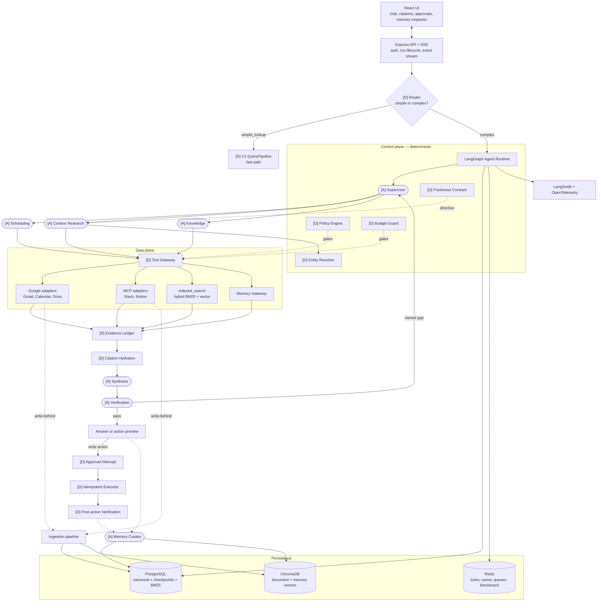
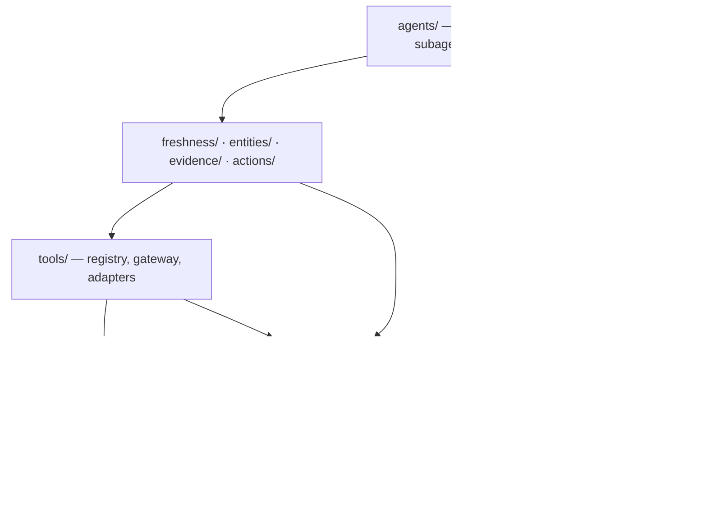

# 00 — System Architecture

Master plan §7.

## Full system

```mermaid
flowchart TD
    subgraph STORES["Persistence"]
        PG[("PostgreSQL<br/>canonical + checkpoints + BM25")]
        CHROMA[("ChromaDB<br/>document + memory vectors")]
        REDIS[("Redis<br/>locks, cache, queues, blackboard")]
    end

    UI["React UI<br/>chat, citations, approvals, memory inspector"]
    API["Express API + SSE<br/>auth, run lifecycle, event stream"]
    UI <--> API

    API --> ROUTER{"[D] Router<br/>simple or complex?"}
    ROUTER -->|"simple_lookup"| FAST["[D] V1 QueryPipeline<br/>fast path"]
    ROUTER -->|"complex"| GRAPH["LangGraph Agent Runtime"]

    subgraph CONTROL["Control plane — deterministic"]
        GRAPH --> SUP(["[A] Supervisor"])
        FRESH["[D] Freshness Contract"]
        POLICY["[D] Policy Engine"]
        BUDGET["[D] Budget Guard"]
        ENT["[D] Entity Resolver"]
    end

    SUP --> RES(["[A] Context Research"])
    SUP --> SCH(["[A] Scheduling"])
    SUP --> KNO(["[A] Knowledge"])
    FRESH -.directive.-> RES
    RES --> ENT

    subgraph DATA["Data plane"]
        TG["[D] Tool Gateway"]
        GOOGLE["Google adapters<br/>Gmail, Calendar, Drive"]
        MCP["MCP adapters<br/>Slack, Notion"]
        RAG["indexed_search<br/>hybrid BM25 + vector"]
        MEMT["Memory Gateway"]
    end

    RES --> TG
    SCH --> TG
    KNO --> TG
    POLICY -.gates.-> TG
    BUDGET -.gates.-> TG
    TG --> GOOGLE
    TG --> MCP
    TG --> RAG
    TG --> MEMT

    GOOGLE --> EVID["[D] Evidence Ledger"]
    MCP --> EVID
    RAG --> EVID
    MEMT --> EVID
    GOOGLE -. "write-behind" .-> ING["Ingestion pipeline"]
    MCP -. "write-behind" .-> ING
    ING --> PG
    ING --> CHROMA

    EVID --> HYD["[D] Citation Hydration"]
    HYD --> SYN(["[A] Synthesis"])
    SYN --> VER(["[A] Verification"])
    VER -->|"pass"| RESP["Answer or action preview"]
    VER -->|"named gap"| SUP

    RESP -->|"write action"| APPR["[D] Approval Interrupt"]
    APPR --> EXEC["[D] Idempotent Executor"]
    EXEC --> CHECK["[D] Post-action Verification"]

    CHECK -.-> CUR(["[A] Memory Curator"])
    RESP -.-> CUR

    CUR --> PG
    CUR --> CHROMA
    GRAPH --> PG
    GRAPH --> REDIS

    GRAPH --> OBS["LangSmith + OpenTelemetry"]
```

## Runtime planes

```mermaid
flowchart LR
    subgraph CP["Control plane"]
        direction TB
        CP1["Graph topology and transitions"]
        CP2["Supervisor decisions"]
        CP3["Freshness contract"]
        CP4["Policy, budgets, retries"]
        CP5["Approval and resume state"]
    end

    subgraph DP["Data plane"]
        direction TB
        DP1["Live MCP and Google calls"]
        DP2["Push, pull, on-demand ingestion"]
        DP3["BM25 keyword retrieval"]
        DP4["Chroma vector retrieval"]
        DP5["Evidence and citation assembly"]
    end

    subgraph MP["Memory plane"]
        direction TB
        MP1["Working state"]
        MP2["Conversational STM"]
        MP3["Episodic, semantic, prospective"]
        MP4["Preference and procedural"]
        MP5["Conflicts, supersession, expiry"]
    end

    subgraph OP["Observability plane"]
        direction TB
        OP1["Agent trajectories"]
        OP2["Distributed traces"]
        OP3["Structured logs"]
        OP4["Metrics"]
        OP5["Immutable action audit"]
    end

    CP --> DP
    DP --> MP
    CP --> OP
    DP --> OP
    MP --> OP
```

## Layer boundaries

The dependency direction is strict — arrows only point downward.

```mermaid
flowchart TD
    L1["agents/ — graph, nodes, subagents, policies"]
    L2["freshness/ · entities/ · evidence/ · actions/"]
    L3["tools/ — registry, gateway, adapters"]
    L4["connectors/ — google, mcp"]
    L5["memory/ · database/ · RAG/"]
    L6["observability/ · utils/ · config/"]

    L1 --> L2
    L2 --> L3
    L3 --> L4
    L2 --> L5
    L3 --> L5
    L1 --> L6
    L5 --> L6

    NOTE["Agents never import a connector directly.<br/>Every source call passes through the Tool Gateway."]
    L1 -.-> NOTE
```
