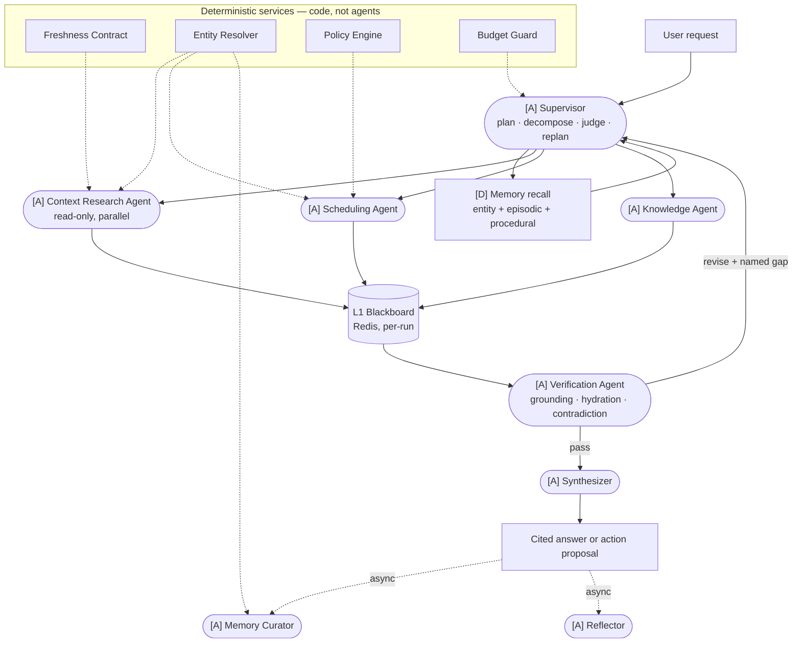
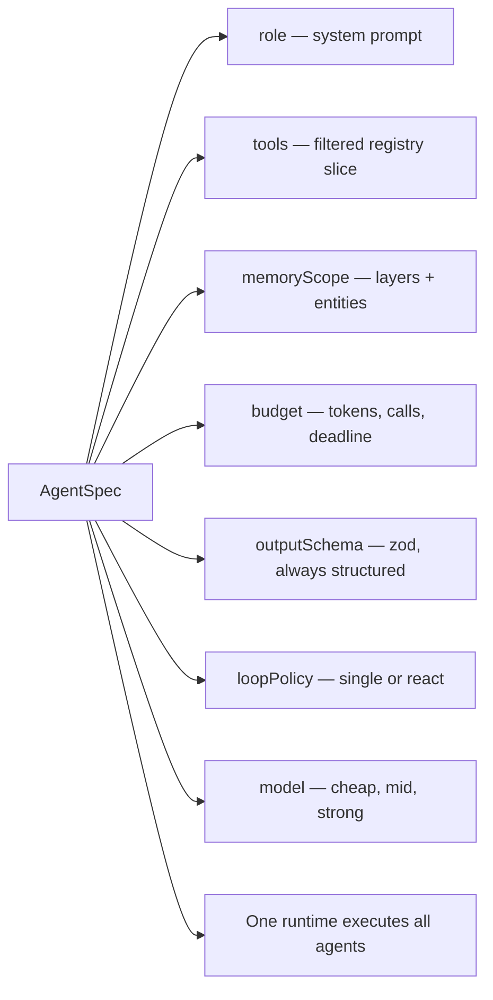
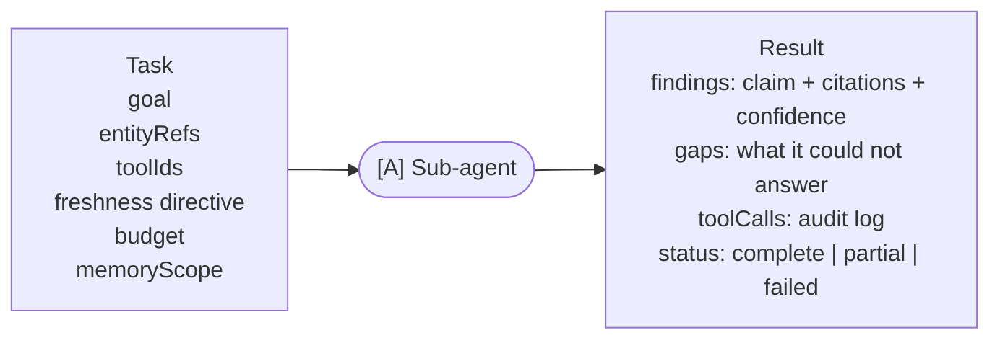
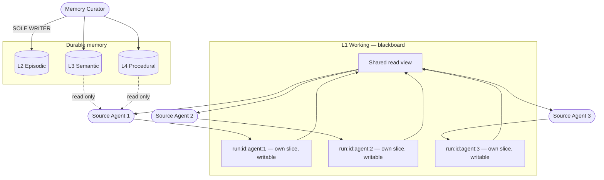
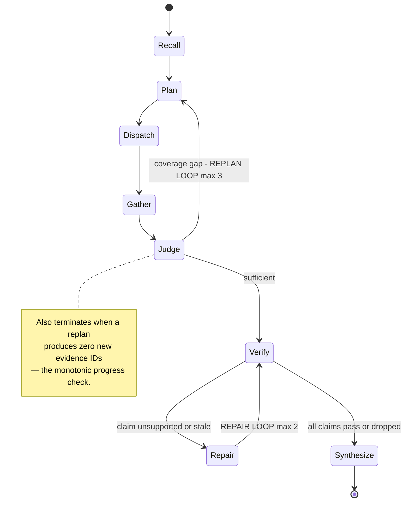

# 01 — Agent Architecture

Master plan §8, §9.

## Agent topology

## Anatomy of an agent

Every agent is the same runtime shell with different configuration. Differences are data, not code.

## Sub-agent contract

Hard rule: sub-agents return **claims plus citations**, never prose. Free-text hand-offs are where
multi-agent systems rot.

## Blackboard access model

Not a shared mutable blob — a Memory Broker with capability-scoped handles.

Three rules:

1. **Single writer to durable memory.** Only the Curator writes L2/L3/L4 — no races, no half-baked facts.
2. **L1 is read-shared, write-partitioned.** Agents see each other's findings; none can clobber them.
3. **Recall is budgeted retrieval, not a dump.** Every agent gets a token budget for memory context.

## Memory access matrix

| Agent | L1 Working | L2 Episodic | L3 Semantic | L4 Procedural |
| --- | --- | --- | --- | --- |
| Supervisor | R + W | R | R | R |
| Context Research | R shared / W own slice | — | R scoped | R |
| Scheduling | R shared / W own slice | — | R scoped | R |
| Knowledge | R shared / W own slice | — | R scoped | R |
| Verification | R | R | R | — |
| Synthesizer | R | — | R | R |
| **Curator** | R | **W** | **W** | **W** |
| Reflector | R | R | R | **W** |

## The two loops

Coverage gaps and grounding failures are different failures and need different loops.

## Autonomy versus bounds

| Model decides — autonomous | Graph enforces — deterministic |
| --- | --- |
| How to decompose the query | That a plan node runs first |
| Which sources are relevant | Which tools exist for this user |
| Which tool, args, order | Per-call budget and timeout |
| Whether findings are sufficient | Cycling back is allowed, max 3 times |
| What to replan and why | Progress check before re-entering |
| Whether a claim is grounded | That verification always runs |
| How to synthesize | Single-writer memory, approval before writes |

The graph never decides *what the answer is* or *what steps to take* — only what is structurally
permitted next.
