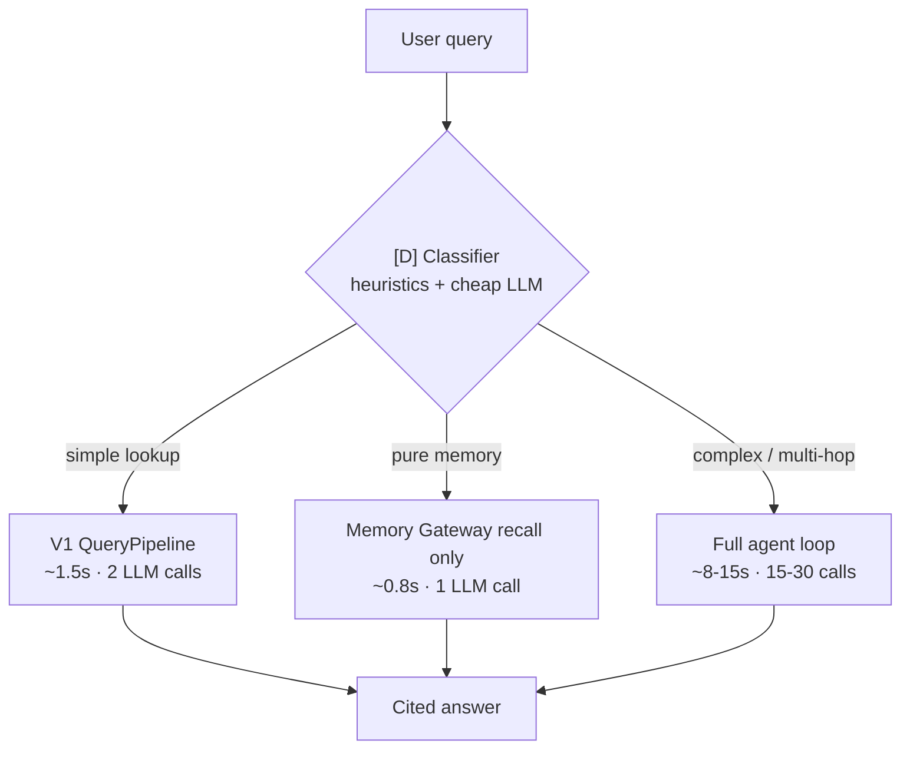
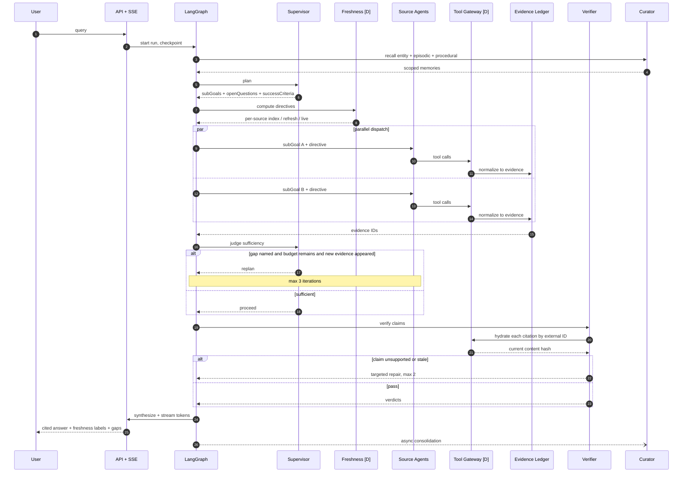
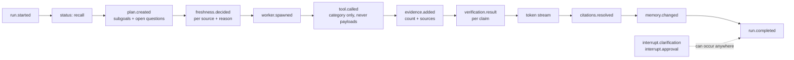
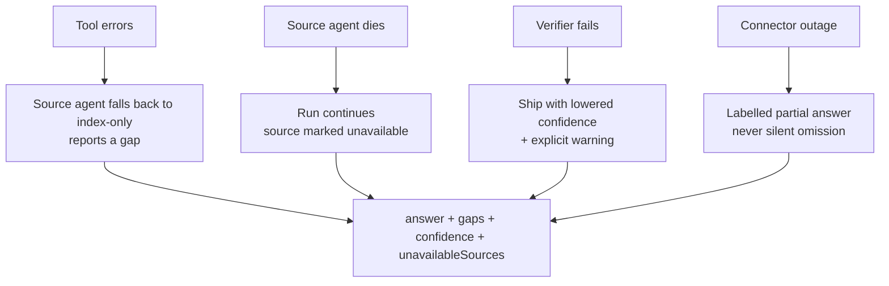
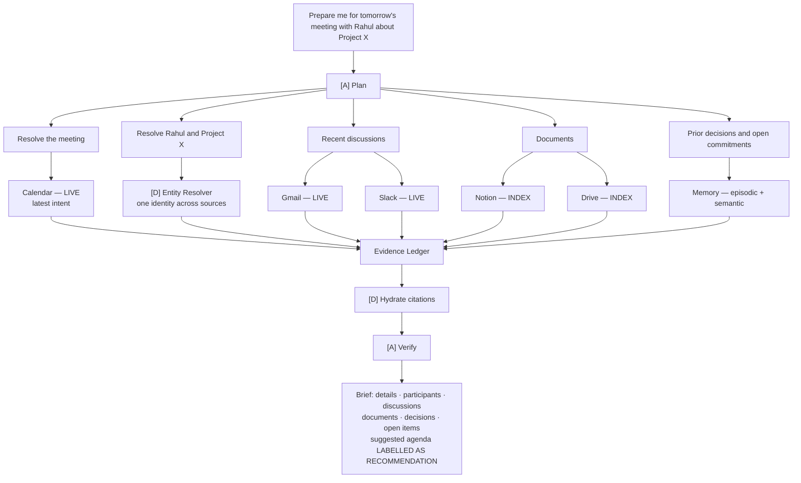

# 02 — Query Flow

Master plan §5, §9.3.

## Flow 0 — Router fast path

Not every query deserves the agent loop. This saves roughly 70% of cost on real traffic.

## Flow 1 — Agentic run lifecycle

## SSE event stream

The reasoning trace is the product's best feature, not a debug view.

## Degradation — partial answers are first-class

## Journey — meeting brief

