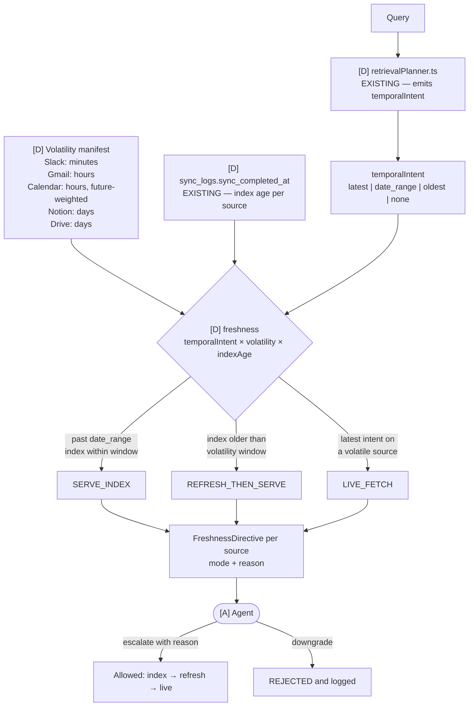
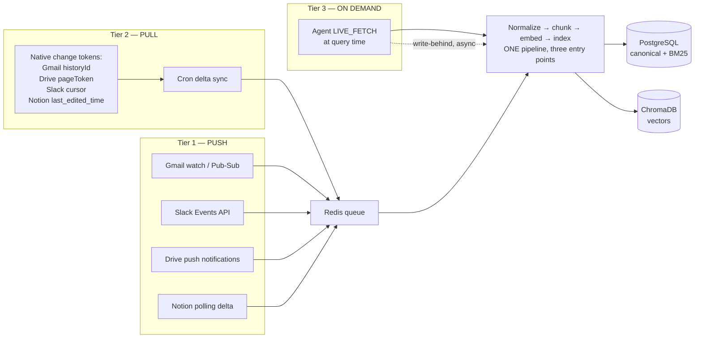
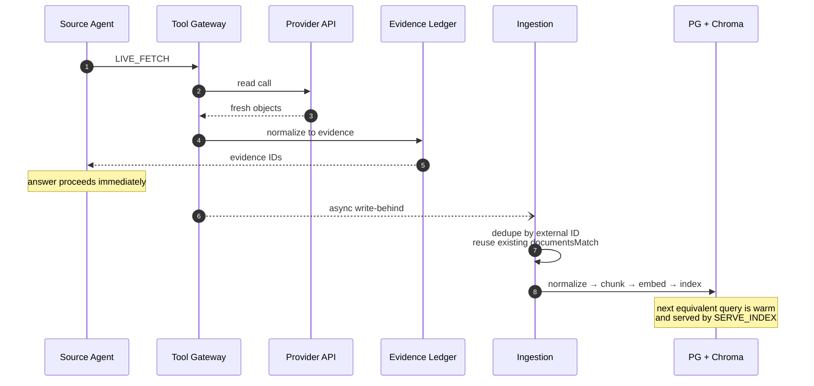
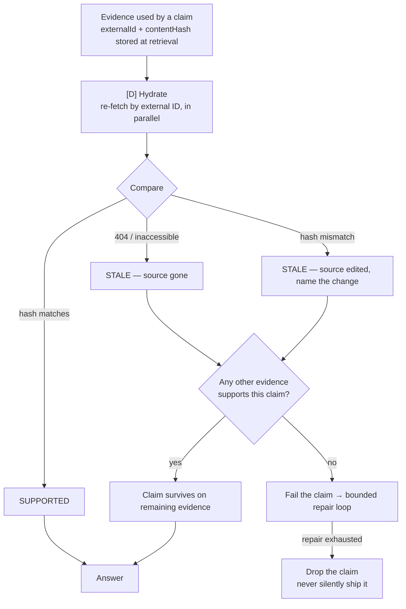
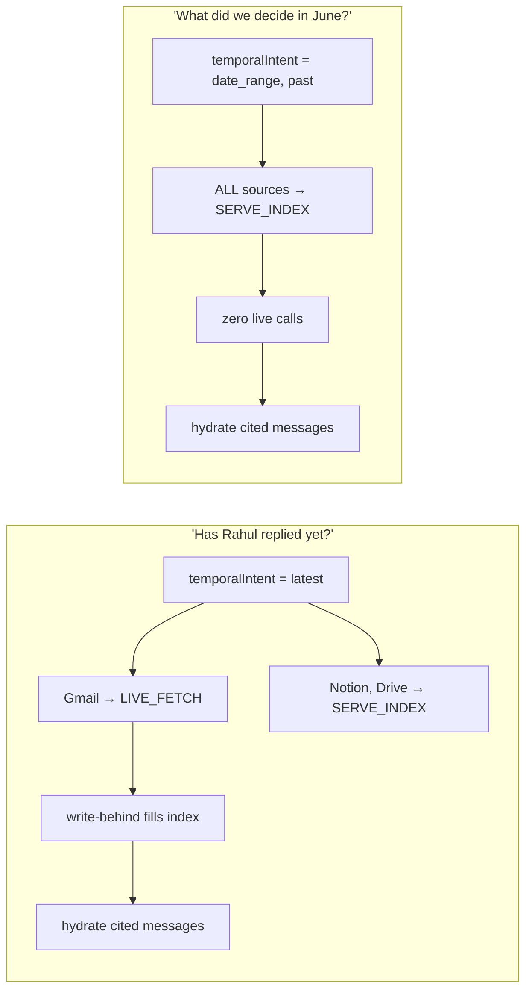

# 03 — Freshness Contract and Live Data

Master plan §8.8, §11.1. Packages FRS-01, FRS-02, FRS-03.

This is the project's headline property. Everything here is deterministic — no model call.

## The contract

**Why deterministic.** The decision is expressible as a rule, so it costs nothing, is unit-testable
across the full input matrix, and fails visibly rather than silently serving stale data. Model
judgment is reserved for escalation, where a rule cannot express the reason.

## Decision table

| temporalIntent | Source volatility | Index age | Mode |
| --- | --- | --- | --- |
| `latest` | minutes / hours | any | `LIVE_FETCH` |
| `latest` | days | within window | `REFRESH_THEN_SERVE` |
| `date_range` in the past | any | any | `SERVE_INDEX` |
| `date_range` including now | minutes / hours | any | `LIVE_FETCH` |
| `oldest` | any | any | `SERVE_INDEX` |
| `none` | any | within window | `SERVE_INDEX` |
| `none` | any | beyond window | `REFRESH_THEN_SERVE` |

## Three-tier data movement

## FRS-02 — Write-behind

Live fetches are never throwaway. This is a read-through cache fill.

A write-behind failure degrades to a logged warning — it never fails the user's run.

## FRS-03 — Citation hydration

Kills the number-one RAG failure: citing an email that was deleted or a page that was edited.

Cost bound: one read call per cited object, in parallel, inside the run's tool budget. Only cited
evidence is hydrated — not the whole retrieval set.

## Worked contrast

The difference between these two runs is deterministic, testable, and visible in the trace — which
is exactly why it gets its own evaluation category.
