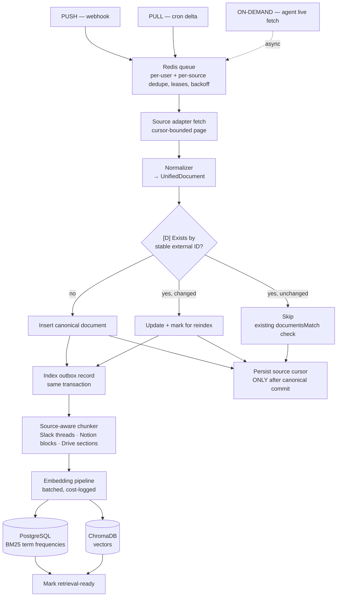
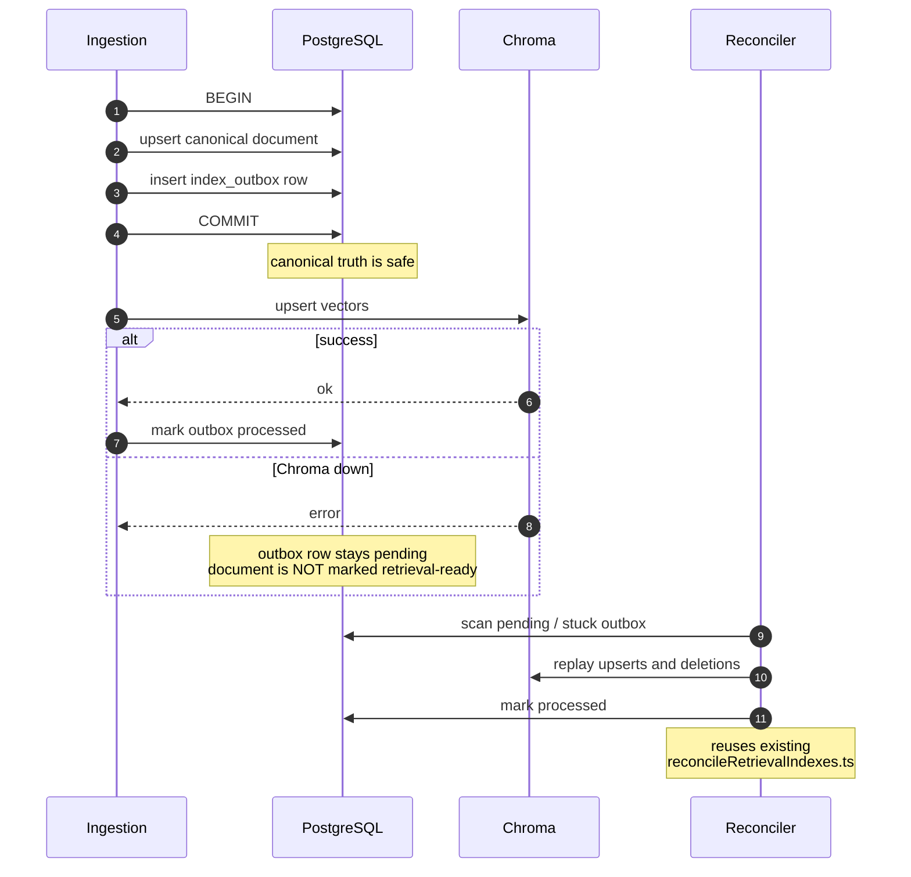
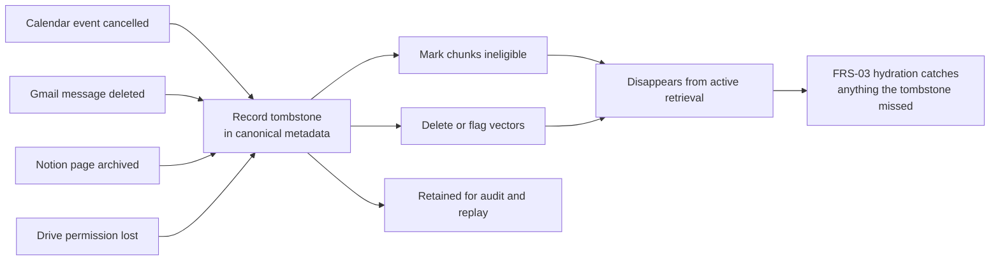

# 04 — Ingestion Pipeline

Master plan §11, ING stream.

## One pipeline, three entry points



## Why the outbox

Canonical records and embeddings commit to two different systems, so they can diverge. Without the
outbox, a failed vector upsert silently produces a document that exists but can never be retrieved.



## Tombstones — ING-02

Deleted and cancelled source objects must stop appearing in retrieval while staying auditable.



Two independent defenses: tombstones remove stale content proactively; citation hydration catches
whatever slipped through at answer time.

## Backfill on connector onboarding

```mermaid
sequenceDiagram
    autonumber
    participant U as User
    participant API as API
    participant C as Connector
    participant TR as Tool Registry
    participant J as Backfill job
    participant WS as Socket.IO

    U->>API: connect source
    alt Google
        API->>C: OAuth, least-privilege read scopes
    else Slack / Notion
        API->>C: MCP handshake
        C->>C: tools/list → JSON Schema → zod
    end
    C-->>TR: register internal stable names
    Note over TR: per-user registry;<br/>agents see only allowed tools

    API->>J: enqueue bounded historical sync
    loop paged
        J->>C: fetch page
        J->>J: normalize → chunk → embed → index
        J->>WS: progress
        WS-->>U: live progress
    end
    J->>C: register webhook if supported
    J-->>TR: mark source available

    Note over TR: agents pick up the new source<br/>with zero code change
```
