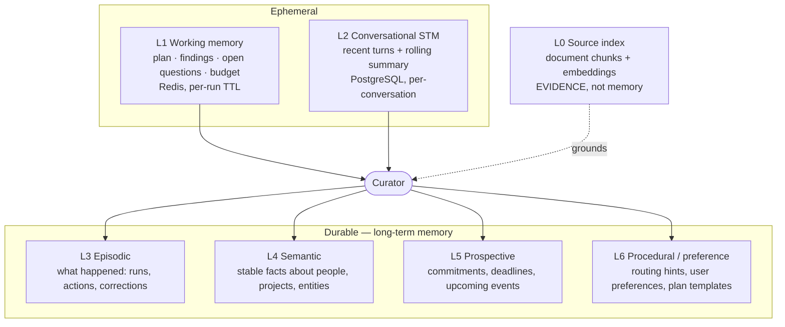
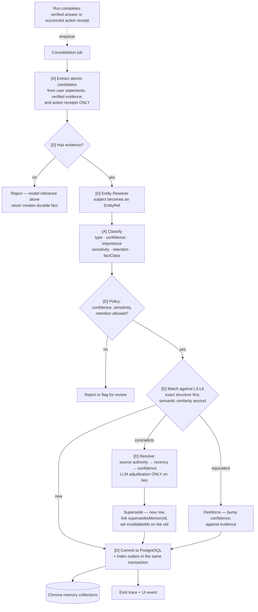
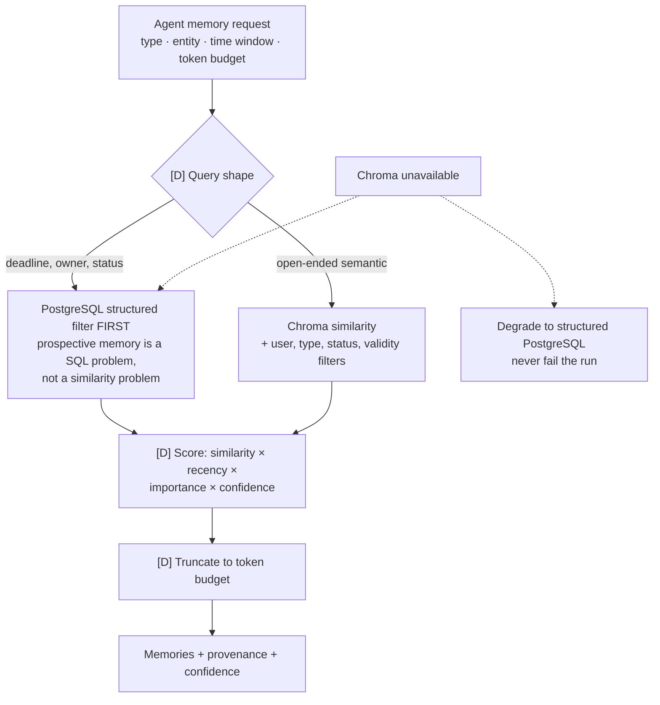
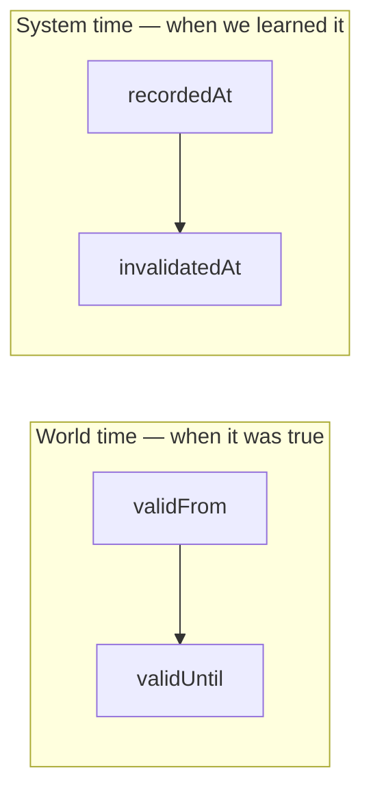
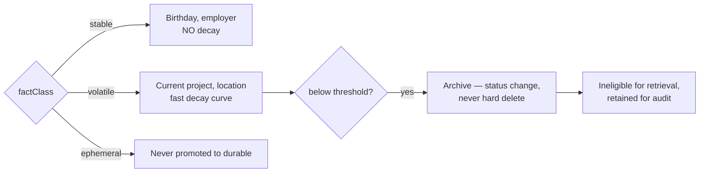
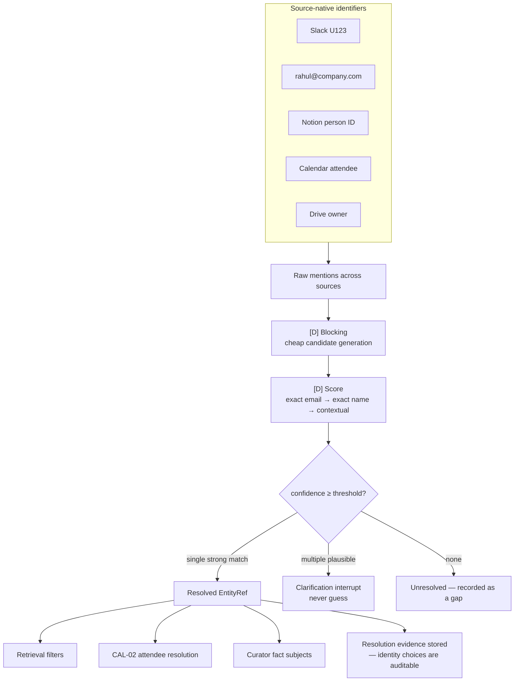
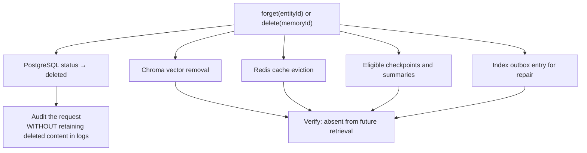
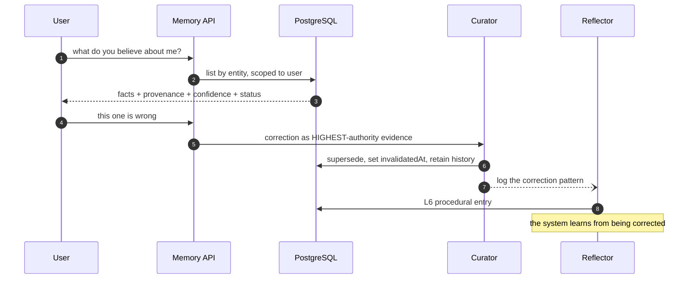

# 05 — Memory Engine

Master plan §10, MEM stream, ENT-01.

## Six layers

L0 is deliberately outside the memory engine: it is retrieval over source documents, not knowledge
the system has formed.

## Write path — always asynchronous

Memory writes never block the user's response. This is the p95-latency answer.

## Read path — scoped retrieval, never a dump

## Bi-temporal model

Two independent time axes. This is what most memory implementations get wrong.

**Worked example.** Rahul changed manager in March. MyRA learns it in June.

| Fact | validFrom | validUntil | recordedAt | invalidatedAt |
| --- | --- | --- | --- | --- |
| Manager is Priya | 2026-01-01 | **2026-03-15** | 2026-01-04 | **2026-06-02** |
| Manager is Arun | **2026-03-15** | — | **2026-06-02** | — |

This answers both *"who is Rahul's manager?"* and *"what did MyRA believe in April?"* — and it means
learning something in June does not retroactively rewrite what the system reported in April.

## Decay by fact class

A single decay curve would either erase stable knowledge or preserve stale knowledge.

## Cross-source entity resolution — ENT-01

Generalizes the existing `retrieval/personResolver.ts`. CAL-02 consumes it rather than
reimplementing attendee matching.

## Deletion — right to forget

## Memory inspector

The single most convincing thing to demo — corrections make the system measurably better.

