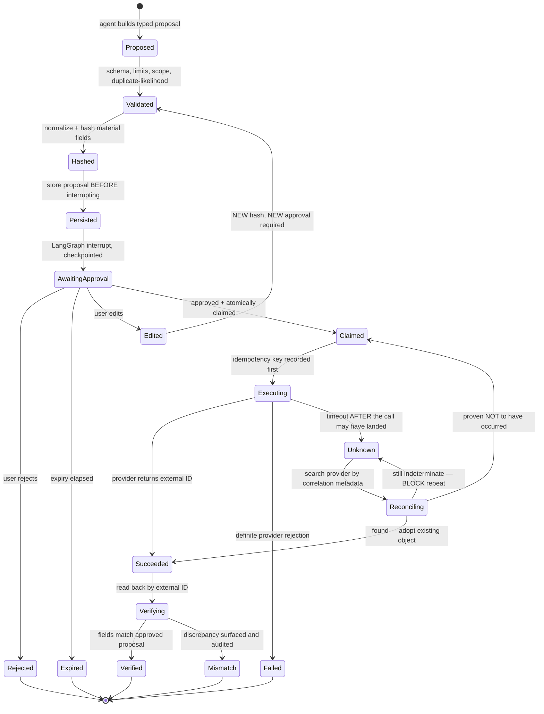
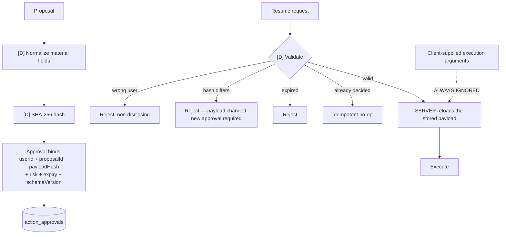
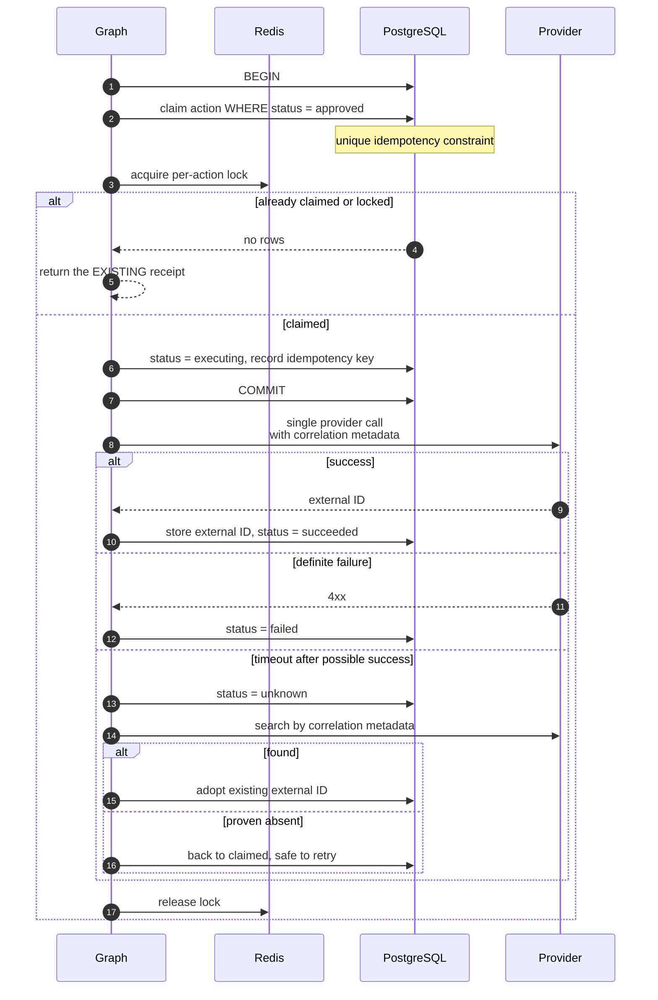
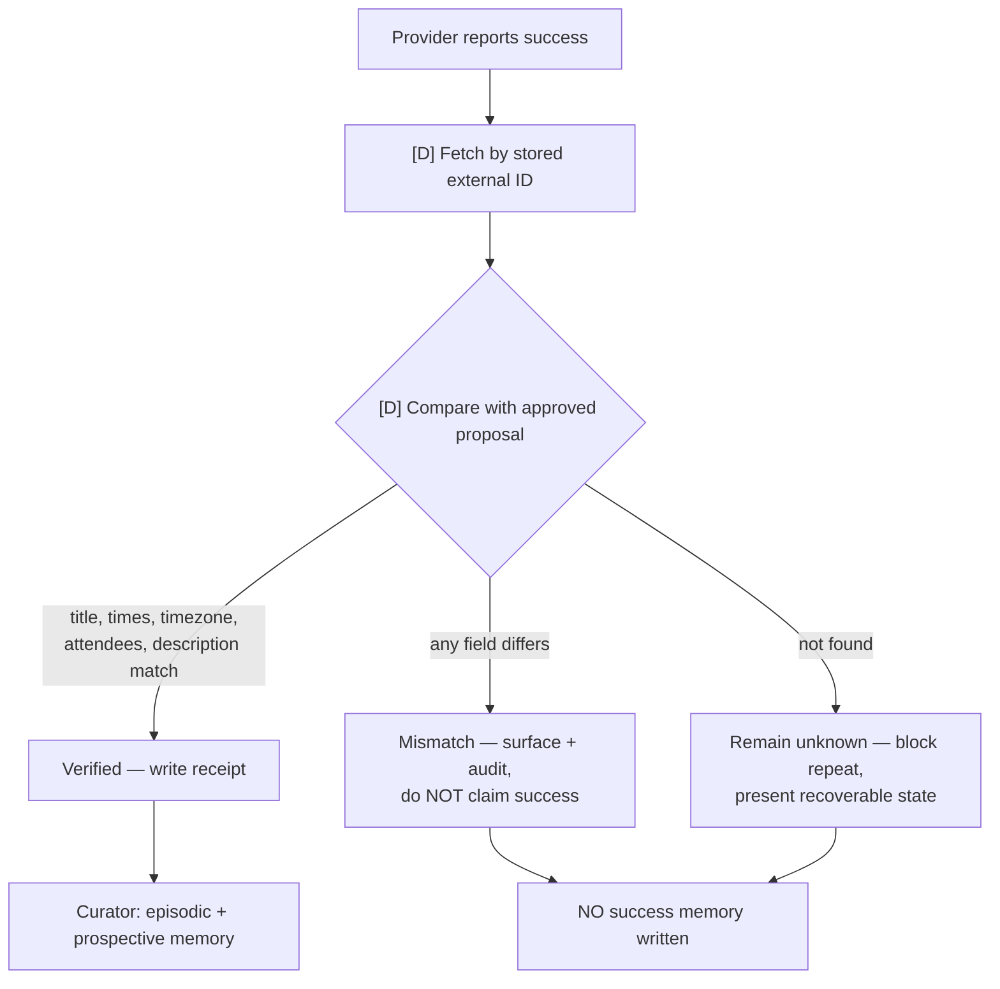
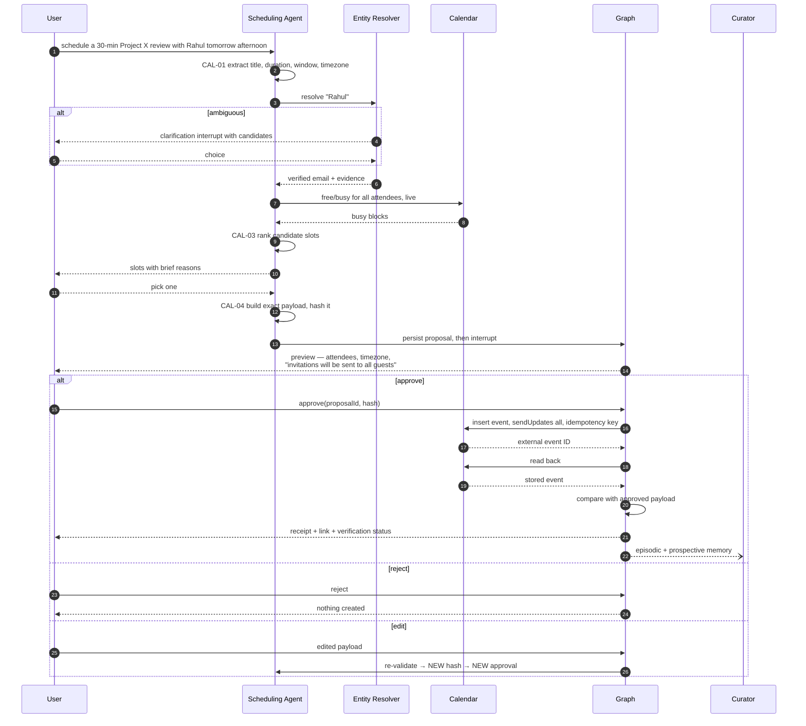

# 06 — Action Approval and Idempotent Execution

Master plan §12.6, CAL stream. Core gate: Calendar create. P1: Gmail send, on the identical machinery.

## The write-action state machine

**Never** is `Unknown` converted into an automatic repeat. Uncertainty is reconciled, not retried.

## Approval binding

The client submits a proposal ID and hash. It never submits execution arguments.

## Idempotent execution

## Post-condition verification

Completion is based on a provider read-back, not on the write response.

A failed or unknown action must never create a false success memory.

## Full user journey — schedule a meeting

## Guarantees

| Guarantee | Mechanism |
| --- | --- |
| Nothing executes without approval | Durable interrupt, proposal persisted first |
| Executed payload equals approved payload | Server reloads by hash; client args ignored |
| At most one side effect | DB unique constraint + Redis lock |
| Timeout never duplicates | `unknown` state + provider reconciliation |
| Completion is real | Provider read-back comparison |
| Edits cannot ride an old approval | Any edit produces a new hash |
| Restart does not lose state | LangGraph checkpoint |
| Everything is explainable | Append-only audit across all transitions |
