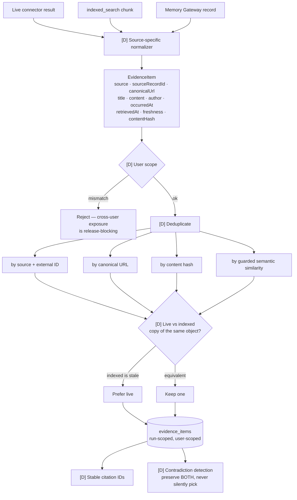
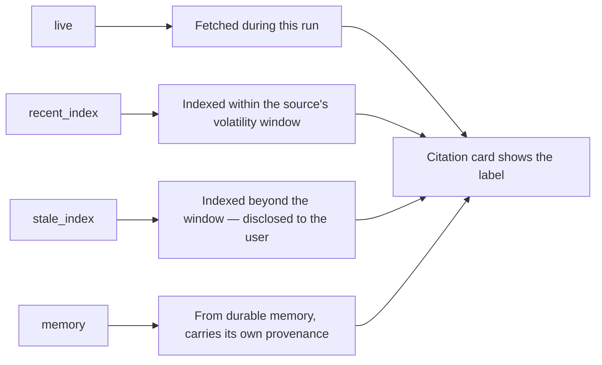
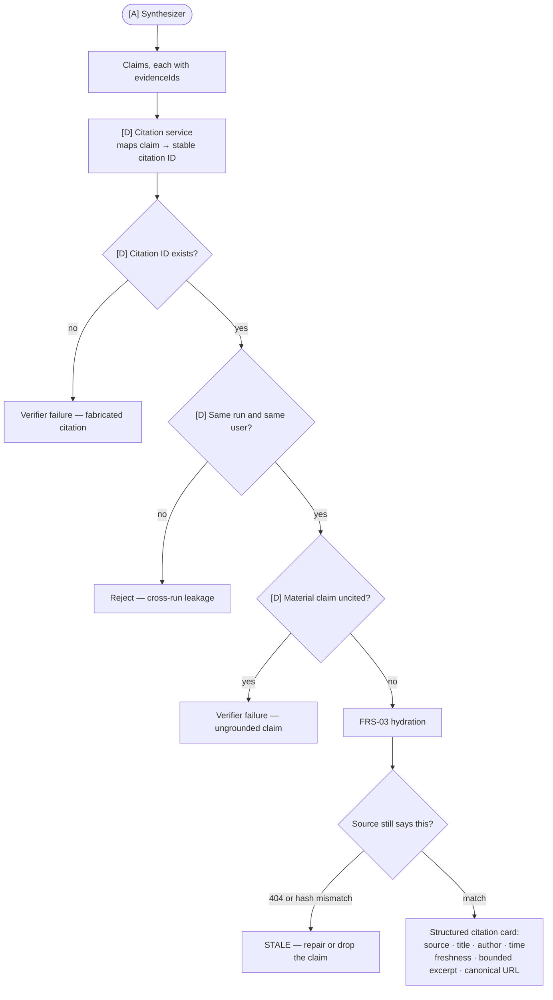
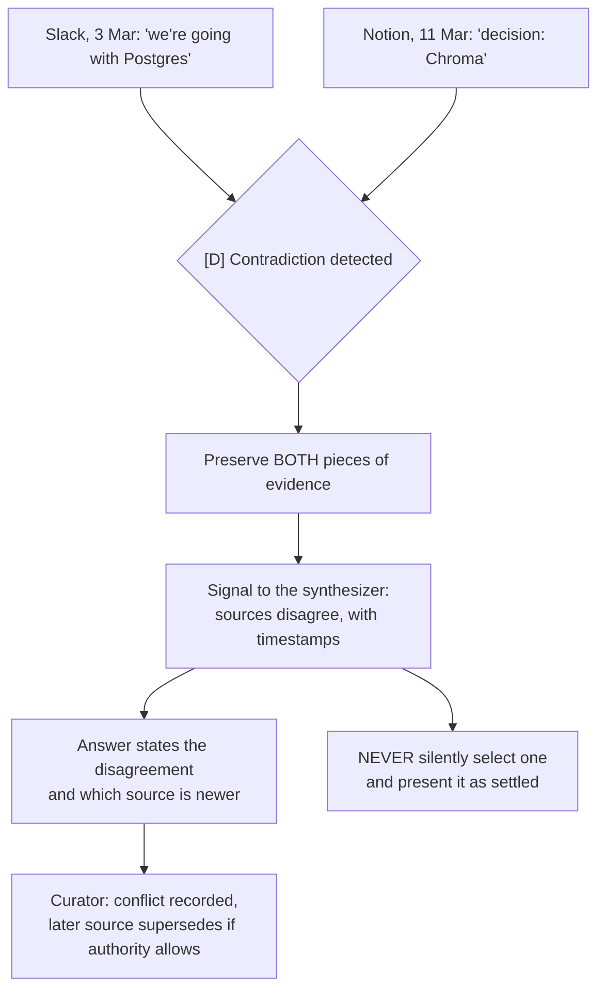

# 08 — Evidence Ledger and Citations

Master plan §11.3–11.5, EVD stream.

## Evidence lifecycle

Large content is stored in the ledger, not in graph state — checkpoints carry evidence IDs only.

## Freshness labelling

## Claim → citation → evidence

The frontend must never rely on model-written `[Source N]` text.

## Contradiction handling

## Why the ledger exists

| Without a ledger | With the ledger |
| --- | --- |
| Citations are model-authored strings | Citations resolve to stored records |
| Live and indexed copies both appear | Deduplicated to one |
| No way to verify a claim after the fact | Every claim traces to a hashed record |
| Replaying a run means re-calling providers | Sanitized snapshots replay offline |
| Cross-user leakage is invisible | Scope is enforced at write and read |
| Deleted sources still get cited | Hydration catches them |
