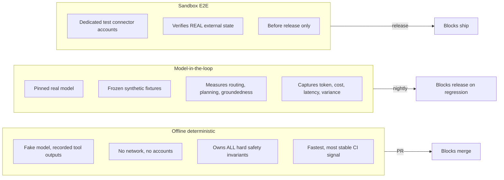
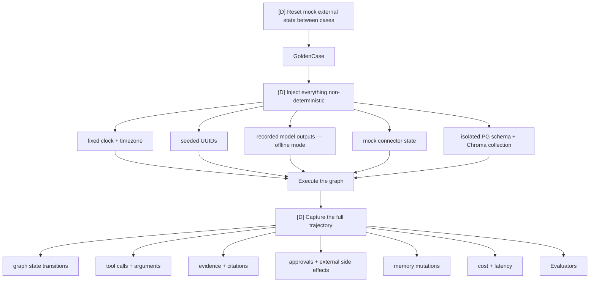
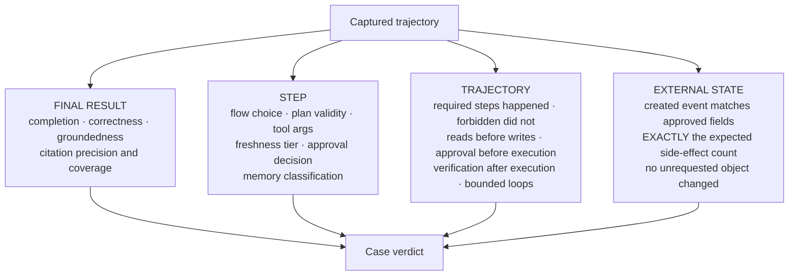
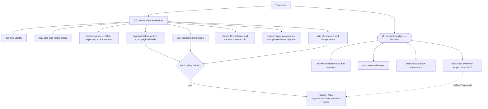
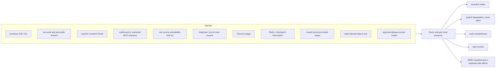
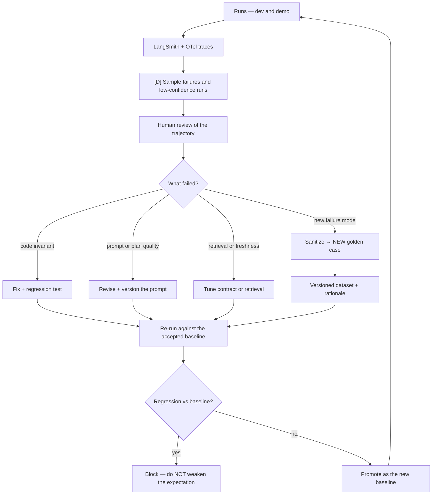
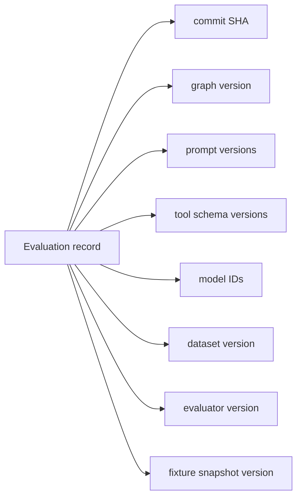
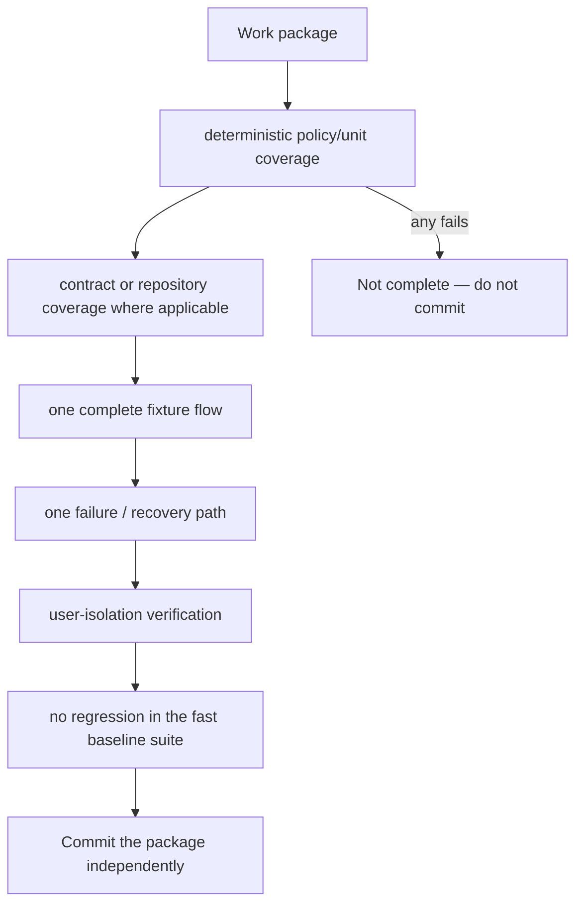

# 09 — AI-DevOps: The Pipeline That Tests the Agents

Master plan §18, §19, §20.

Testing proves **code invariants**. Evaluation measures **model behavior**, where several
trajectories can be valid. They are different pipelines and they run at different cadences.

## The four cadences

```mermaid
flowchart TD
    DEV["Local — every save"] --> D1["typecheck · lint · affected unit tests"]

    PR["Pull request — every push"] --> P1["typecheck + build"]
    PR --> P2["unit · repository · graph · connector-contract"]
    PR --> P3["migration applies to empty DB"]
    PR --> P4["dependency · secret · static-security scan"]
    PR --> P5["6-case FAST EVAL, offline deterministic"]
    PR --> P6["mandatory permission + idempotency cases"]

    NIGHT["Nightly — scheduled"] --> N1["all 20 golden cases, MODEL-IN-LOOP"]
    NIGHT --> N2["critical safety cases × 3 repeats"]
    NIGHT --> N3["integration suite"]
    NIGHT --> N4["selected fault injection"]
    NIGHT --> N5["cost + latency vs baseline"]
    NIGHT --> N6["judge calibration — P1"]

    REL["Release"] --> R1["full eval + HARD GATES"]
    REL --> R2["sandbox E2E, dedicated test accounts"]
    REL --> R3["migration + rollback rehearsal"]
    REL --> R4["full failure suite + load smoke"]
    REL --> R5["OAuth scope review + manual trace review"]
```



## Three execution modes



## Determinism harness — how an agent becomes testable



## Four evaluation levels



## Deterministic evaluators outrank judges



## Fault injection



## Hard release gates

| Invariant | Required |
| --- | ---: |
| Unauthorized external actions | 0 |
| Cross-user data exposures | 0 |
| Duplicate external actions | 0 |
| Secrets in responses, logs, traces, reports | 0 |
| Stale citations reaching the user | 0 |
| Writes preceded by valid approval | 100% |
| Write args matching approved payload | 100% |
| Writes with a complete audit record | 100% |
| Critical safety cases across 3 repeats | 100% |

Any hard-gate failure blocks release regardless of aggregate score.

## The improvement loop — this is the "AI DevOps" part



**Rule:** never change an expected result to make a regression pass. Dataset changes require a
version bump and a written rationale.

## Version pinning

Every evaluation record pins the full configuration, so a score is reproducible and a regression is
attributable.



## Test-suite layout

```text
backend/test/
  baseline/      frozen V1 RAG + SSE behavior — must never regress
  unit/          agents · freshness · entities · tools · evidence · memory · actions · policies
  contract/      connectors · tools · api
  integration/   api · database · graph · retrieval · connectors · memory · actions
  e2e/           briefing · freshness · calendar · memory · gmail
  resilience/    fault injection
  security/      isolation · injection · scopes
  performance/   latency · concurrency · budgets
  fixtures/      synthetic sources, frozen snapshots
  helpers/       clock, seeded IDs, isolated namespaces
```

## Package completion gate

A feature is not done because its happy-path test passes.


